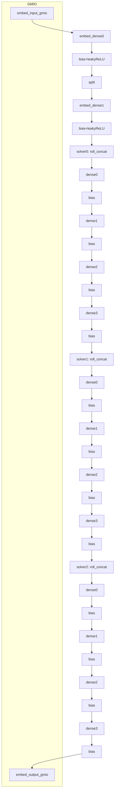

# Real‑Time Track Data Analysis (RTDA) – Versal AI Engine Demo

This project demonstrates a fully in‑AIE inference pipeline for real‑time particle track processing. Each input frame is a single track represented by a fixed‑length float vector. The design embeds the track, then passes it through three solver stages, and streams results back over GMIO. All intermediate activations remain on‑chip inside the AI Engine array.

[PLACEHOLDER: Architecture diagram of stages and GMIO]

[Inline Mermaid preview]

[PLACEHOLDER: Rendered diagram image]

---

## About This Project

- Pure AI Engine compute with GMIO ingress/egress, managed by an XRT host.
- Four stages total: 1 embed + 3 solver stages (stateful track pairing via a `torch.roll`‑like kernel).
- Runtime‑programmable weights and biases via RTP; no recompile needed for parameter changes.
- Validated in x86/hardware simulation and packaged for VEK280‑class platforms.

---

## Repository Structure

- `aieml/` – AI Engine graph and kernels (primary implementation)
- `pl/` – Optional HLS kernels and benches; not required for the AIE‑only flow
- `host/` – XRT host application and Makefile
- `common/` – Shared headers (tensor sizes, file name constants)
- `data/` – Default inputs/weights/goldens; override with `DATA_DIR`
- `model/`, `tools/` – Python utilities for (re)generating vectors and reference outputs
- `Makefile` – Top‑level build, link, package, and run targets

Key files:
- `aieml/graph.h:1` – Graph declaration, ports, kernels, RTP definitions
- `aieml/graph.cpp:1` – Simulation‑time host wrapper (AIE sim) to drive GMIO and RTP
- `aieml/graph_layout.hpp:1` – Runtime ratio hints and (optional) placement nudges
- `aieml/nn_defs10.h:1` – Canonical tensor sizes and cascade tiling constants
- `aieml/bias_relu_fused.cpp:1` – Fused bias + leaky‑ReLU kernel
- `aieml/window_split_128_to_64x2.cpp:1` – 128→64×2 splitter kernel
- `aieml/roll_concat.cpp:1` – Stateful pairing kernel (PyTorch‑like roll with 50‑track window)
- `common/data_paths.h:1` – All file names used by the host and AIE sim driver
- `host/host.cpp:1` – XRT host: XCLBIN load, RTP updates, GMIO transfers

[PLACEHOLDER: Repo map graphic]

[See also: docs/dataflow.mmd]

---

## Architecture and Data Model

- Stages:
  1. Embed: `embed_dense0` → bias+leakyReLU → split(128→64×2) → `embed_dense1` → bias+leakyReLU
  2. Solver 0: `roll_concat` → dense0(4‑way) → bias+leakyReLU → split → dense1(2‑way) → bias+leakyReLU → split → dense2(2‑way) → bias+leakyReLU → split → dense3(2‑way) → bias+leakyReLU
  3. Solver 1: identical to Solver 0
  4. Solver 2: identical to Solver 0, then stream out over GMIO

- Data types: `float32` for all inputs, weights, biases, and activations.
- Framing: one input frame = one track vector; one output frame = 128‑float activation.

### Dimensions and Parameters (aieml/nn_defs10.h)

- `INPUT_SIZE` (default 8) – number of features per track; set to 128 for full tracks: `aieml/nn_defs10.h:4`
- `HIDDEN_SIZE = 128`, `OUTPUT_SIZE = 128`
- `LEAKY_SLOPE = 0.1f`
- `ROLL_CONC_SUBSET_SIZE = 2` → `roll_concat` produces 256 values (2×128)
- Embed cascades: `EMBED_DENSE0_CASC_LEN = 1`, `EMBED_DENSE1_CASC_LEN = 2`
- Solver shapes: `SUBSOLVER0_INPUT_SIZE = 256`, `SUBSOLVER0_INPUT_PARTS = 4` (dense0 is 4‑way)
- Solver cascades: `SUBSOLVER0_LAYER_WEIGHTS_PARTS = 2` (dense1/2/3 are 2‑way)
- Output pad available but not used in current top: `OUTPUT_DENSE0_OUT_PAD = 32`

### Layer Inventory (rows × cols, datatype: float32)

- `embed_dense0`: 128 × `INPUT_SIZE` (casc=1)
- `embed_dense1`: 128 × 128 (casc=2; two weight parts)
- `solver{i}_dense0` i∈{0,1,2}: 128 × 256 (casc=4; four parts, 64 cols each)
- `solver{i}_dense{1,2,3}`: 128 × 128 (casc=2; two parts, 64 cols each)

### Custom Kernels

- `bias_add_leaky_relu_kernel` – adds bias and applies leaky‑ReLU; forwards zeros on padded tail.
- `window_split_128_to_64x2` – splits 128‑wide activations into two 64‑wide legs for cascaded MM.
- `roll_concat_kernel` – per‑frame stateful pairing mimicking `torch.roll` but with the following twist:
  - Counts only valid (non‑zero) frames toward a 50‑track window.
  - Emits zeros until the first valid frame appears (deterministic cold‑start).
  - Normal operation emits `[current, previous]` concatenations (256 floats).
  - After each 50 valid tracks, emits a wrap pair `[first_snapshot, last_frame]` (zero‑padded rather than infinite wrap).

[PLACEHOLDER: roll_concat timing diagram]

See: `docs/roll_concat.mmd` for a sequence diagram of the 50-track windowing behaviour.

### Ports and GMIO

- Input GMIO: `g.embed_input_gmio` — one frame = `INPUT_SIZE` floats
- Output GMIO: `g.embed_output_gmio` — one frame = 128 floats
- RTP ports:
  - Embed: `g.embed_matrixA0_rtp`, `g.embed_matrixA1_{0,1}_rtp`, `g.embed_bias{0,1}_rtp`
  - Solvers (per stage i): `g.solveri_dense0_matrixA_rtp[0..3]`, `g.solveri_dense{1,2,3}_matrixA_rtp[0..1]`, `g.solveri_bias{0..3}_rtp`

GMIO calls:
- AIE sim driver uses `input_gmio::gm2aie_nb` / `output_gmio::aie2gm_nb` (non‑blocking).
- Host binds XRT BOs and invokes `bo.async(..., "g.embed_input_gmio")` / `bo.async(..., "g.embed_output_gmio")` which is functionally equivalent to g2aie_nb/aie2gm_nb from the AI Engine API.

---

## Environment Setup

- Create and activate the Conda toolchain:
  - `conda env create -f hls_env.yml && conda activate hls_env`
- Source board/platform environment (Vitis, platform path, XRT, DSPlib hints):
  - `source set_envs.sh`
- Optional dataset override:
  - `export DATA_DIR=$PWD/data_casc8` (defaults to `./data` if unset)
- Optional DSPLIB override if not in repo:
  - `export DSPLIB_PATH=/path/to/vitis_dsp`

Prerequisites:
- AMD Vitis 2025.1 (per `Makefile` defaults) with AI Engine tools
- XRT runtime and headers installed and discoverable (see `host/Makefile`)
- Platform files for the target board (e.g., VEK280 base platform)

---

## Build, Link, Package, Run

From the repo root:

- Build AIE graph:
  - `make aie TARGET=sw_emu` (maps to x86sim under the hood)
  - `make aie TARGET=hw_emu` (maps to hw)
  - `make aie TARGET=hw` (hardware model)
- AIE simulation only:
  - `make sim TARGET=sw_emu` (x86 functional)
  - `make sim TARGET=hw` (cycle‑accurate `aiesimulator`)
- Build host:
  - `make host TARGET=sw_emu` (native x86)
  - `make host TARGET=hw_emu` (QEMU/aarch64)
- Link XSA and package:
  - `make package TARGET=sw_emu|hw_emu|hw` → produces `package.<target>/system_<target>.xclbin`
- Run emulation:
  - `make run TARGET=sw_emu` (x86 or QEMU depending on `EMU_PS`)
  - `make run TARGET=hw_emu` (QEMU)

Artifacts:
- `aieml/Work/libadf.a` — compiled AIE graph
- `build_<target>/design_<target>.xsa` — linked system archive
- `package.<target>/system_<target>.xclbin` — packaged binary
- `host.exe` — host launcher copied into the SD image / emu dir

[PLACEHOLDER: build pipeline diagram]

---

## Data and File Naming

Default dataset: `./data` (or `DATA_DIR`). File constants live in `common/data_paths.h:1`.

- Embed
  - `embed_input.txt` — input frames, length multiple of `INPUT_SIZE`
  - `embed_dense_0_weights.txt` — 128 × `INPUT_SIZE`
  - `embed_dense_1_weights_part{0,1}.txt` — 128 × 64 each
  - `embed_dense_0_bias.txt`, `embed_dense_1_bias.txt` — 128 each
- Solver i (i = 0,1,2)
  - `solver_i_dense_0_weights_part{0..3}.txt` — 128 × 64 each
  - `solver_i_dense_{1,2,3}_weights_part{0,1}.txt` — 128 × 64 each
  - `solver_i_dense_{0,1,2,3}_bias.txt` — 128 each
- Output
  - `aieml10_output_aie.txt` — host/AIE sim output (`run_count × 128` floats)

Regenerate tensors:
- `python data/generate_test_data.py --input-dim 128 --hidden-dim 128 --output-dim 128 --dtype float32`
- Keep script args in sync with `aieml/nn_defs10.h` after changing dimensions.

---

## Host Application

- Binary: `./host.exe`
- Usage: `./host.exe package.<target>/system_<target>.xclbin`
- Responsibilities:
  - Load XCLBIN, open `xrt::graph g`
  - Read tensors from `DATA_DIR` and update RTP ports
  - Allocate XRT BOs and perform GMIO async transfers
  - Run `g.run(run_count)` and write `aieml10_output_aie.txt`

See: `host/README.md:1` for details on shapes, transfers, and build options.

---

## Important Notes and Parameters

- To process full 128‑float tracks, set `INPUT_SIZE = 128` in `aieml/nn_defs10.h:4` and regenerate data.
- `roll_concat` pairs current/previous valid frames and injects window wrap pairs every 50 valid tracks; it pads zeros on cold‑start and for all‑zero frames.
- GMIO bandwidth/fifo depths can be tuned in `aieml/graph.h:1` (`GMIO_*_BANDWIDTH_MBPS`, `DEFAULT_FIFO_DEPTH`).

---

## Validation and Profiling

- AIE x86 simulation: `make sim TARGET=sw_emu` or `make -C aieml sim TARGET=x86sim`
- AIE cycle‑accurate simulation: `make sim TARGET=hw` then inspect:
  - `vitis_analyzer aieml/Work/aiesimulator_output/default.aierun_summary`
- Emulation logs are under `package.<target>/` launch scripts or console output.

Reports summary (compiled interface): see `docs/reports.md` for GMIO burst/bandwidth and RTP dimensions automatically derived from the build (`aieml/Work/vfs/aie_interface_spec.json`).

---

## Troubleshooting

- Missing tools/variables → re‑source `set_envs.sh`
- Data size mismatch → host reports file path and expected count
- Input length not multiple of `INPUT_SIZE` → host aborts
- GMIO stalls in sim → check `aieml/Work/aiesimulator_output/` status logs

---

## Roadmap / TODO

- [ ] Add final output dense layer (optional post‑solver projection)
- [ ] Integrate PL data movers for alternate IO schemes (if required)
- [ ] Attach analyzer screenshots and performance numbers

[PLACEHOLDER: Performance/latency chart]

---

## License

See `LICENSE` at the repository root.
