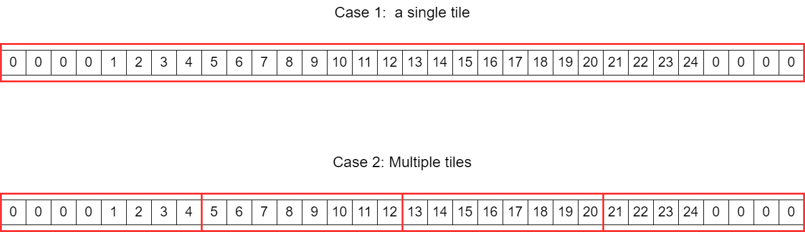
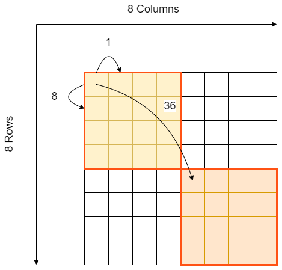

<table class="sphinxhide" style="width:100%;">
  <tr>
    <td align="center">
      <picture>
        <source media="(prefers-color-scheme: dark)" srcset="https://raw.githubusercontent.com/Xilinx/Image-Collateral/main/logo-white-text.png">
        
      </picture>
      <h1>AMD Vitis™ AI Engine Tutorials</h1>
      <a href="https://www.amd.com/en/products/software/adaptive-socs-and-fpgas/vitis.html">See Vitis™ Development Environment on amd.com</a>
        </br>
      <a href="https://www.amd.com/en/products/software/vitis-ai.html">See Vitis™ AI Development Environment on amd.com</a>
    </td>
  </tr>
</table>
# Buffer Descriptors

## Introduction

DMA programming is performed through _Tiling Parameters_. These parameters describe how the data should be accessed in the memory on a tile basis. Dimension 0 is the dimesion where the data are contiguous in memory. The overall dimension of the buffer is specified and then the tile dimension and the number of tiles to read in each dimension.

This is actually aa EoU layer above the real hardware. The actual DMA programming is controlled through _Buffer Descriptors_. Their usage is cumbersome compared to tiling parameters, that's why the latter are used for DAM programming. Unfortunately from time to time, during AI Engine compilation, you may have error messages like:

```shell
```

In order to understand why you get this type of message, I encourage you to read this small section.

## Buffer Descriptors overview

Buffer descriptors are a set of registers that exist within Memory Modules, Memory Tiles and AI Engine-ML Interfaces that allows DMA programming. It is a way to program the address generator so that data can be read or written from/to the memory. It describes an access scheme that is repeated over and over.

The number of MM2S/S2MM and buffer descriptors is different in the 3 different domains:

| Location | Number of MM2S/S2MM | Number of BDs | AI Engine | AI Engine-ML |
| --- | :---: | :---: | :---: | :---: |
| Memory Module | 2/2 | 16 | &#10003; | &#10003; |
| Memory Tile | 6/6 | 48 (24+24) | NA | &#10003; |
| AI Engine Array Interface  | 2/2 | 16 | &#10003; | &#10003; |

In memory modules and Array Interface, the 16 BDs can be accessed by all MM2S and S2MM. In Memory tiles, the BDs and DMA channels are split in 2 sets:

- S2MM and MM2S index 0, 2, 4 can access BD from 0 to 23
- S2MM and MM2S index 1, 3, 5 can access BD from 24 to 47

## Buffer Descriptor parameters

The goal of this section is just to show you the main registers that compose a buffer descriptor, it's not a full training on BD programming. The documents for a complete register description for AI Engine and AI Engine-ML are the following:

- [Register Reference for AI Engine](https://docs.amd.com/r/en-US/am015-versal-aie-register-reference)
  - [Memory Module Registers](https://docs.amd.com/r/en-US/am015-versal-aie-register-reference/DMA_BD0_Addr_A-AIE_MEMORY_MODULE-Register)
  - [NoC Module Registers](https://docs.amd.com/r/en-US/am015-versal-aie-register-reference/DMA_BD0_Control-AIE_NOC_MODULE-Register)
- [Register Reference for AI Engine-ML](https://docs.amd.com/r/en-US/am025-versal-aie-ml-register-reference)
  - [Memory Module Registers](https://docs.amd.com/r/en-US/am025-versal-aie-ml-register-reference/DMA_BD0_0-MEMORY_MODULE-Register)
  - [Memory Tile Registers](https://docs.amd.com/r/en-US/am025-versal-aie-ml-register-reference/DMA_BD0_0-MEMORY_TILE_MODULE-Register)
  - [NoC Module Registers](https://docs.amd.com/r/en-US/am025-versal-aie-ml-register-reference/DMA_BD0_0-NOC_MODULE-Register)

For this tutorial we will concentrate on the AI Engine-ML device family.

The address generator sees the data as 1 to 3 or 4 dimension data set. For each dimension these registers define _stride_ and _wrap_ values. The address generator starts at some initial value and then iterates using (stride, wrap) pairs, up to a certain number of address generated. For example for a 2D data set the values stride(0), wrap(0) and stride(1) are defined. The value wrap(1) does not need to be specified as the total number of address generated is defined by the transfer length. Each of these registers are specified on a certain number of bits:

### AI Engine ML registers bit width

Data access:

| Register Name | Memory Module | Memory Tile | NoC Module |
| :---: | :---: | :---: | :---: |
| Base Address | 14 | 19 | 46 |
| Buffer Length | 14 | 17 | 32 |
| D0 Stepsize | 13 | 17 | 20 |
| D0 Wrap | 8 | 10 | 10 |
| D1 Stepsize | 13 | 17 | 20 |
| D1 Wrap | 8 | 10 | 10 |
| D2 Stepsize | 13 | 17 | 20 |
| D2 Wrap |  NA | 10 | NA |
| D3 Stepsize | NA | 17 | NA |

In order to handle zero-padding there exist another set of registers in the Memory Tile:

| Register Name | Memory Tile |
| :---: | :---: |
| D0 Zero Before | 6 |
| D0 Zero After | 6 |
| D1 Zero Before | 5 |
| D1 Zero After | 5 |
| D2 Zero Before | 4 |
| D2 Zero After | 4 |

### BD counting

On standard dataflow graphs, there is **always 2 phases** to get a continuous dataflow without restarting the BDs. 

This means that **the number of BDs, as computed hereafter, is multiplied by 2**.

Zero padding is a special case. Let's look at these 2 cases:



In the first case a single BD is enough, it will generate the zeros before and after the tile on the fly using the 2 registers _D0\_Zero\_Before_ and _D0\_Zero\_After_ set to 4.

In case 2 3 BDs will be necessary:

- The first one with _D0\_Zero\_Before_ set to 4.
- The second one with these 2 registers set to 0.
- The third one with _D0\_Zero\_After_ set to 4.


### BD example

Suppose we have an 8x8 buffer (int32) and we want to extract the top-left 4x4 tile and the lower-right 4x4 tile.



Extracting a 4x4 tile supposes that we have the following parameters:

| | Value | Comment |
| --- | :---: |  --- |
| Step 0 | 1 | All samples are contiguous on 1 row |
| Wrap 0 | 4 | The number of columns of the extracted tile is 4 |
| Step 1 | 8 | The address of the first sample of the second row is 8 after the first sample of first row |
| Wrap 1 | 4 | The number of rows of the extracted tile is 4 |

The address jump between the first 4x4 tile and the second 4x4 tile is 36. This is the relative address of the first sample of the second tiles vs. the address of the first sample of the first tile. There is no wrap on this dimension as the transfer will end after 32 samples transferred:

| | Value | Comment |
| --- | :---: |  --- |
| Step 2 | 36 | Jump in between the 2 tiles |
| Buffer Length | 32 | Total transferred samples |


### AI Engine Compiler Report

The AI Engine compiler produces a report that contains some data about Buffer Descriptors: _Work/report/compiler_report.json_.

```json
"i0_pi0": {
    "dmaInfo": {
        "tile": "memory",
        "column": 11,
        "row": 0,
        "direction": "s2mm",
        "channel": 0,
        "bufferDescriptor": [
            0,
            1
        ]
    }
}
```

The python script _ExtractBDNumbers.py_ is included in this tutorial in the `Utils` directory to easily extract this information.

## Support

GitHub issues will be used for tracking requests and bugs. For questions, go to [support.xilinx.com](https://support.xilinx.com/).

<p class="sphinxhide" align="center"><sub>Copyright © 2025 Advanced Micro Devices, Inc.</sub></p>

<p class="sphinxhide" align="center"><sup><a href="https://www.amd.com/en/corporate/copyright">Terms and Conditions</a></sup></p>
