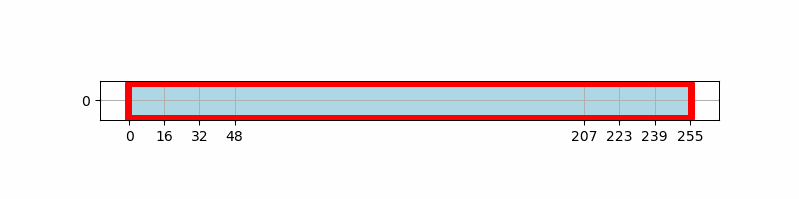
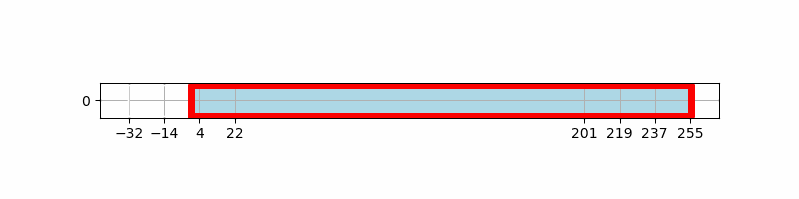
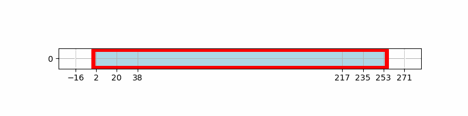
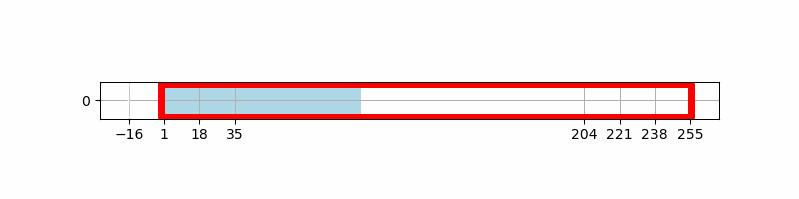
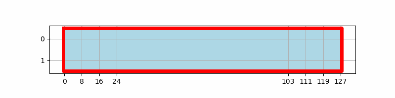
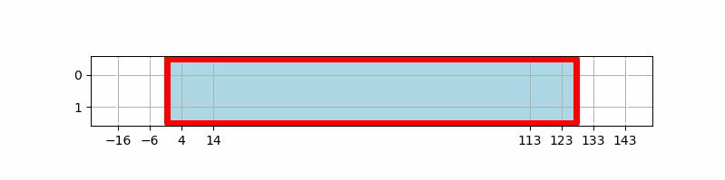
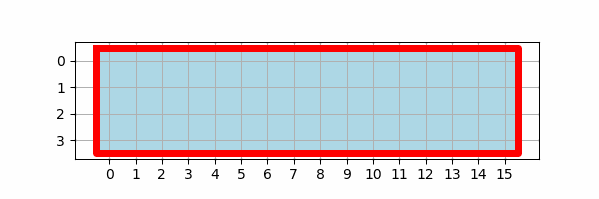
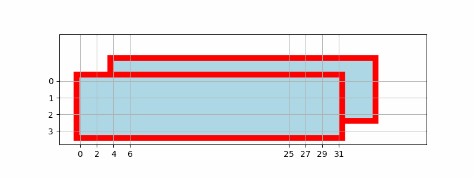
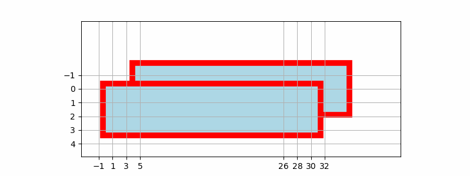

<table class="sphinxhide" style="width:100%;">
  <tr>
    <td align="center">
      <picture>
        <source media="(prefers-color-scheme: dark)" srcset="https://raw.githubusercontent.com/Xilinx/Image-Collateral/main/logo-white-text.png">
        
      </picture>
      <h1>AMD Vitis™ AI Engine Tutorials</h1>
      <a href="https://www.amd.com/en/products/software/adaptive-socs-and-fpgas/vitis.html">See Vitis™ Development Environment on amd.com</a>
        </br>
      <a href="https://www.amd.com/en/products/software/vitis-ai.html">See Vitis™ AI Development Environment on amd.com</a>
    </td>
  </tr>
</table>

# Tiling Parameter Programming Documentation Examples


## Introduction

In this section we'll go over all the examples presented in the [UG1603](https://docs.xilinx.com/r/en-US/ug1603-ai-engine-ml-kernel-coding). This is the minimum to understand before creating your own Tiling Parameters.

All these examples are implemented in the tutorial code in the directory `src_doc`. For all these examples only two input files are used:
-Input_1D_256.txt
-Input_1D_64.txt

These files are understood in various ways depending on the example.

For 1D data (Input_1D_64.txt):
```
Tile: 0
 0  1  2  3  4  5  6  7  8  9 10 11 12 13 14 15 16 17 18 19 20 21 22 23 24 25 26 27 28 29 30 31 32 33 34 35 36 37 38 39 40 41 42 43 44 45 46 47 48 49 50 51 52 53 54 55 56 57 58 59 60 61 62 63
------------------------------------------------------------
Tile: 1
1000 1001 1002 1003 1004 1005 1006 1007 1008 1009 1010 1011 1012 1013 1014 1015 1016 1017 1018 1019 1020 1021 1022 1023 1024 1025 1026 1027 1028 1029 1030 1031 1032 1033 1034 1035 1036 1037 1038 1039 1040 1041 1042 1043 1044 1045 1046 1047 1048 1049 1050 1051 1052 1053 1054 1055 1056 1057 1058 1059 1060 1061 1062 1063
------------------------------------------------------------
Tile: 2
2000 2001 2002 2003 2004 2005 2006 2007 2008 2009 2010 2011 2012 2013 2014 2015 2016 2017 2018 2019 2020 2021 2022 2023 2024 2025 2026 2027 2028 2029 2030 2031 2032 2033 2034 2035 2036 2037 2038 2039 2040 2041 2042 2043 2044 2045 2046 2047 2048 2049 2050 2051 2052 2053 2054 2055 2056 2057 2058 2059 2060 2061 2062 2063
------------------------------------------------------------
Tile: 3
3000 3001 3002 3003 3004 3005 3006 3007 3008 3009 3010 3011 3012 3013 3014 3015 3016 3017 3018 3019 3020 3021 3022 3023 3024 3025 3026 3027 3028 3029 3030 3031 3032 3033 3034 3035 3036 3037 3038 3039 3040 3041 3042 3043 3044 3045 3046 3047 3048 3049 3050 3051 3052 3053 3054 3055 3056 3057 3058 3059 3060 3061 3062 3063
------------------------------------------------------------
Tile: 4
4000 4001 4002 4003 4004 4005 4006 4007 4008 4009 4010 4011 4012 4013 4014 4015 4016 4017 4018 4019 4020 4021 4022 4023 4024 4025 4026 4027 4028 4029 4030 4031 4032 4033 4034 4035 4036 4037 4038 4039 4040 4041 4042 4043 4044 4045 4046 4047 4048 4049 4050 4051 4052 4053 4054 4055 4056 4057 4058 4059 4060 4061 4062 4063
------------------------------------------------------------
```

For 2D data (Input_1D_64.txt):
```
Tile: 0
 0  1  2  3  4  5  6  7  8  9 10 11 12 13 14 15
16 17 18 19 20 21 22 23 24 25 26 27 28 29 30 31
32 33 34 35 36 37 38 39 40 41 42 43 44 45 46 47
48 49 50 51 52 53 54 55 56 57 58 59 60 61 62 63
------------------------------------------------------------
Tile: 1
1000 1001 1002 1003 1004 1005 1006 1007 1008 1009 1010 1011 1012 1013 1014 1015
1016 1017 1018 1019 1020 1021 1022 1023 1024 1025 1026 1027 1028 1029 1030 1031
1032 1033 1034 1035 1036 1037 1038 1039 1040 1041 1042 1043 1044 1045 1046 1047
1048 1049 1050 1051 1052 1053 1054 1055 1056 1057 1058 1059 1060 1061 1062 1063
------------------------------------------------------------
Tile: 2
2000 2001 2002 2003 2004 2005 2006 2007 2008 2009 2010 2011 2012 2013 2014 2015
2016 2017 2018 2019 2020 2021 2022 2023 2024 2025 2026 2027 2028 2029 2030 2031
2032 2033 2034 2035 2036 2037 2038 2039 2040 2041 2042 2043 2044 2045 2046 2047
2048 2049 2050 2051 2052 2053 2054 2055 2056 2057 2058 2059 2060 2061 2062 2063
------------------------------------------------------------
Tile: 3
3000 3001 3002 3003 3004 3005 3006 3007 3008 3009 3010 3011 3012 3013 3014 3015
3016 3017 3018 3019 3020 3021 3022 3023 3024 3025 3026 3027 3028 3029 3030 3031
3032 3033 3034 3035 3036 3037 3038 3039 3040 3041 3042 3043 3044 3045 3046 3047
3048 3049 3050 3051 3052 3053 3054 3055 3056 3057 3058 3059 3060 3061 3062 3063
------------------------------------------------------------
Tile: 4
4000 4001 4002 4003 4004 4005 4006 4007 4008 4009 4010 4011 4012 4013 4014 4015
4016 4017 4018 4019 4020 4021 4022 4023 4024 4025 4026 4027 4028 4029 4030 4031
4032 4033 4034 4035 4036 4037 4038 4039 4040 4041 4042 4043 4044 4045 4046 4047
4048 4049 4050 4051 4052 4053 4054 4055 4056 4057 4058 4059 4060 4061 4062 4063
------------------------------------------------------------
```

Or 3D data (Input_1D_256.txt):

```
Tile: 0

Layer = 0
  0   1   2   3   4   5   6   7   8   9  10  11  12  13  14  15
 16  17  18  19  20  21  22  23  24  25  26  27  28  29  30  31
 32  33  34  35  36  37  38  39  40  41  42  43  44  45  46  47
 48  49  50  51  52  53  54  55  56  57  58  59  60  61  62  63

        Layer = 1
         64  65  66  67  68  69  70  71  72  73  74  75  76  77  78  79
         80  81  82  83  84  85  86  87  88  89  90  91  92  93  94  95
         96  97  98  99 100 101 102 103 104 105 106 107 108 109 110 111
        112 113 114 115 116 117 118 119 120 121 122 123 124 125 126 127

                Layer = 2
                128 129 130 131 132 133 134 135 136 137 138 139 140 141 142 143
                144 145 146 147 148 149 150 151 152 153 154 155 156 157 158 159
                160 161 162 163 164 165 166 167 168 169 170 171 172 173 174 175
                176 177 178 179 180 181 182 183 184 185 186 187 188 189 190 191

                        Layer = 3
                        192 193 194 195 196 197 198 199 200 201 202 203 204 205 206 207
                        208 209 210 211 212 213 214 215 216 217 218 219 220 221 222 223
                        224 225 226 227 228 229 230 231 232 233 234 235 236 237 238 239
                        240 241 242 243 244 245 246 247 248 249 250 251 252 253 254 255
------------------------------------------------------------
```


## Example usage

You can compile and simulate all these Documentation Examples. X86 and AI Engine compilation and simulation are acceptable. X86 tends to be faster:

```bash
 make SECTION=doc clean_all data x86 x86sim
 ```
 
 Or

```bash
 make SECTION=doc clean_all data aie aiesim
 ```

 
All examples are now being compiled and simulated. Destination files are created in the `x86simulator_output/data` directory. 1D examples output files are starting at `10` (Output_10.txt, Output_11.txt, ...). 2D examples start with `20` and 3D examples start with `30`.


## 1D Examples
### 1D Linear Transferring From Source to Destination

In this example, the input data is transferred from the source to the destination without any changes. The input data is read in a linear fashion and written to the destination in a linear fashion using 3 different tiling parameters.

The first way is to just specify the buffer dimension and the tiling dimension as the same. This is the simplest way to transfer data from source to destination.

```c
adf::read_access(mtxin.out[0]) = adf::tiling({
    .buffer_dimension = {256},
    .tiling_dimension = {256},
    .offset = {0}});
```

For the other ways  a stride and a wrap are added to the tiling parameters. the stride is the distance between the start of the next tile and the start of the current tile in the specified dimensions. The wrap is the number of Tiles to read before moving to the next tile traversal. 

In the second way the tiling dimension is equal to the buffer dimension so a single tile will be transferred (wrap = 1), so the straide value is not important.

```C
adf::read_access(mtxin.out[0]) = adf::tiling({
    .buffer_dimension = {256},
    .tiling_dimension = {256},
    .offset = {0}});
```

In the third way the tiling dimension is set to 1 so 256 tiles will be transferred (wrap = 256), and the stride should be 1in order to read all data in a sequential way.


```C
adf::read_access(mtxin.out[2]) = adf::tiling({
    .buffer_dimension = {256},
    .tiling_dimension = {1},
    .offset = {0},
    .tile_traversal = {{.dimension = 0, .stride = 1, .wrap = 256}} });
```

In a general manner the wrap can be set to `w` and the stride (and the tiling dimension) must be set to `s` in such a way that `s*w = 256`. In order to start to read from the beginning of the buffer the offset should be set to 0.



The red frame represents the buffer area, the moving blue frame is the tile area (this changes over time if there are multiple tiles). The light blue area is the validated buffer area, the one which is within the boundaries, as defined in the tiling parameters (all buffer by default). The white area within the buffer and outside the buffer will be replaced by zeros by the reading DMA.

Using `GetTiles.py` one can dig inside output files:

- filename `doc_x86simulator_output/data/Output_10.txt` 
- `1Do` tile with optimized display
- `256`  tile width 256
- `0 1`display tiles from 0 to 1

```shell
Utils/GetTiles.py doc_x86simulator_output/data/Output_10.txt 1Do 256 0 1
```
The output for this command line is:
 ```shell
 ------------------------------------------------------

filename: doc_x86simulator_output/data/Output_10.txt
NCols: 256
NRows: 1
NLayers: 1

------------------------------------------------------

Static Tile Selection

Tile: 0
  0   1   2   3   4   5   6   7   8   9  10  11  12  13  14  15  16  17  18  19    ...    236 237 238 239 240 241 242 243 244 245 246 247 248 249 250 251 252 253 254 255
------------------------------------------------------------
Tile: 1
1000 1001 1002 1003 1004 1005 1006 1007 1008 1009 1010 1011 1012 1013 1014 1015 1016 1017 1018 1019    ...    1236 1237 1238 1239 1240 1241 1242 1243 1244 1245 1246 1247 1248 1249 1250 1251 1252 1253 1254 1255
------------------------------------------------------------
```


### 1D Linear With Zero Pre-padding

In this example, the input data is transferred from the source to the destination with zero pre-padding. The input data is read in a linear fashion with a negative offset that allows the DMA to prepend the data with zeros.

```C
adf::read_access(mtxin.out[0]) = adf::tiling(
    {.buffer_dimension = {256},
     .tiling_dimension = {256},
     .offset = {-32},
     .tile_traversal = {{.dimension = 0, .stride = 256, .wrap = 1}}});
```

In this case the offset is set to -32, so the DMA will prepend 32 zeros before the data is transferred. As the tiling dimension is still 256, some data won't be transferred:



We can display the data from output file:

```shell
Utils/GetTiles.py doc_x86simulator_output/data/Output_13.txt 1D 256 0
```

This gives:

```shell
------------------------------------------------------

filename: doc_x86simulator_output/data/Output_13.txt
NCols: 256
NRows: 1
NLayers: 1

------------------------------------------------------

Static Tile Selection

Tile: 0
  0   0   0   0   0   0   0   0   0   0   0   0   0   0   0   0   0   0   0   0   0   0   0   0   0   0   0   0   0   0   0   0   0   1   2   3   4   5   6   7   8   9  10  11  12  13  14  15  16  17  18  19  20  21  22  23  24  25  26  27  28  29  30  31  32  33  34  35  36  37  38  39  40  41  42  43  44  45  46  47  48  49  50  51  52  53  54  55  56  57  58  59  60  61  62  63  64  65  66  67  68  69  70  71  72  73  74  75  76  77  78  79  80  81  82  83  84  85  86  87  88  89  90  91  92  93  94  95  96  97  98  99 100 101 102 103 104 105 106 107 108 109 110 111 112 113 114 115 116 117 118 119 120 121 122 123 124 125 126 127 128 129 130 131 132 133 134 135 136 137 138 139 140 141 142 143 144 145 146 147 148 149 150 151 152 153 154 155 156 157 158 159 160 161 162 163 164 165 166 167 168 169 170 171 172 173 174 175 176 177 178 179 180 181 182 183 184 185 186 187 188 189 190 191 192 193 194 195 196 197 198 199 200 201 202 203 204 205 206 207 208 209 210 211 212 213 214 215 216 217 218 219 220 221 222 223
------------------------------------------------------------
```
We can see the prepending zeros.

### 1D Linear With Zero Pre and Post-padding

In this example, the input data is transferred from the source to the destination with zero preand post-padding. The input data is read in a linear fashion with a negative offset that allows the DMA to prepend the data with zeros.

```C
adf::read_access(mtxin.out[0]) = adf::tiling(
    {.buffer_dimension = {256},
     .tiling_dimension = {288},
     .offset = {-16},
     .tile_traversal = {{.dimension = 0, .stride = 256, .wrap = 1}},
     .boundary_dimension = {256}});
```

In this case the offset is set to -16, so the DMA will prepend 16 zeros before the data is transferred. As the tiling dimension is 288, 16 zeros will be transferred after the buffer:



We can display the data from output file using the tiling dimension of 288.

```shell
Utils/GetTiles.py doc_x86simulator_output/data/Output_14.txt 1Do 288 0
```

This gives:
```shell
------------------------------------------------------

filename: doc_x86simulator_output/data/Output_14.txt
NCols: 288
NRows: 1
NLayers: 1

------------------------------------------------------

Static Tile Selection

Tile: 0
  0   0   0   0   0   0   0   0   0   0   0   0   0   0   0   0   0   1   2   3    ...    252 253 254 255   0   0   0   0   0   0   0   0   0   0   0   0   0   0   0   0
------------------------------------------------------------
```


### 1D Linear With Zero Pre and Post-padding with buffer boundary setting

In this example, the input data is transferred from the source to the destination with zero pre and post-padding. The input data is read in two tiles. As the stride is larger that the tile width, some data inside the buffer won't be transmitted. The new parameter here is the boundary that restrict the buffer area that is read and transmitted:

```C
adf::read_access(mtxin.out[0]) = adf::tiling(
    {.buffer_dimension = {256},
     .tiling_dimension = {128},
     .offset = {-16},
     .tile_traversal = {{.dimension = 0, .stride = 144, .wrap = 2}},
     .boundary_dimension = {96}});
```

In this case the offset is set to -16, so the DMA will prepend 16 zeros before the data is transferred. As the tiling dimension is 128, 16 zeros will be transferred after the buffer. The boundary being set at 96, zeros will be transmitted at the end of the first tile ( tile width (128) - boundary (96) + offset (-16) = 16 zeors at the end). The second tile is only zeros:



We can display the output data for the 2 iterations (4 ouput tiles):

```shell
Utils/GetTiles.py doc_x86simulator_output/data/Output_15.txt 1Do 128 0 3
```

The output is:
```shell
------------------------------------------------------

filename: doc_x86simulator_output/data/Output_15.txt
NCols: 128
NRows: 1
NLayers: 1

------------------------------------------------------

Static Tile Selection

Tile: 0
 0  0  0  0  0  0  0  0  0  0  0  0  0  0  0  0  0  1  2  3    ...    92 93 94 95  0  0  0  0  0  0  0  0  0  0  0  0  0  0  0  0
------------------------------------------------------------
Tile: 1
0 0 0 0 0 0 0 0 0 0 0 0 0 0 0 0 0 0 0 0    ...    0 0 0 0 0 0 0 0 0 0 0 0 0 0 0 0 0 0 0 0
------------------------------------------------------------
Tile: 2
   0    0    0    0    0    0    0    0    0    0    0    0    0    0    0    0 1000 1001 1002 1003    ...    1092 1093 1094 1095    0    0    0    0    0    0    0    0    0    0    0    0    0    0    0    0
------------------------------------------------------------
Tile: 3
0 0 0 0 0 0 0 0 0 0 0 0 0 0 0 0 0 0 0 0    ...    0 0 0 0 0 0 0 0 0 0 0 0 0 0 0 0 0 0 0 0
------------------------------------------------------------
```

## 2D Examples
### 2D Linear transfer from source to destination

Let start with a simple data transfer example. The buffer is seen as a 128 columns 2 rows data set:

```shell
  0   1   2   3   4   5   6   7   8   9  10  11  12  13  14  15  16  17  18  19    ...    108 109 110 111 112 113 114 115 116 117 118 119 120 121 122 123 124 125 126 127
128 129 130 131 132 133 134 135 136 137 138 139 140 141 142 143 144 145 146 147    ...    236 237 238 239 240 241 242 243 244 245 246 247 248 249 250 251 252 253 254 255
```
The input data is read in a linear fashion and written to the destination in a linear fashion using 2 different tiling parameters.

The first way is to just specify the buffer dimension and the tiling dimension as the same. This is the simplest way to transfer data from source to destination.

```c
adf::read_access(mtxin.out[0]) = adf::tiling({.buffer_dimension = {128, 2},
                                                .tiling_dimension = {128, 2},
                                                .offset = {0,0}});
```

A second possibility is to write read the data row by row using a one-dimensional tile:

```c 
adf::read_access(mtxin.out[1]) = adf::tiling({
            .buffer_dimension = {128, 2},
            .tiling_dimension = {128, 1},
            .offset = {0, 0},
            .tile_traversal = {
                {.dimension = 0, .stride = 128, .wrap = 1},
                {.dimension = 1, .stride = 1, .wrap = 2}}});
```

The tile traversal on dimension 0 is not mandatory. The second read access pattern will generate 2 reads from the share buffer in the following way:



Let's diplay the output:

```shell
Utils/GetTiles.py doc_x86simulator_output/data/Output_20.txt 2Do 128 2 0
```

This give:

```shell
------------------------------------------------------

filename: doc_x86simulator_output/data/Output_20.txt
NCols: 128
NRows: 2
NLayers: 1

------------------------------------------------------

Static Tile Selection

Tile: 0
  0   1   2   3   4   5   6   7   8   9  10  11  12  13  14  15  16  17  18  19    ...    108 109 110 111 112 113 114 115 116 117 118 119 120 121 122 123 124 125 126 127
128 129 130 131 132 133 134 135 136 137 138 139 140 141 142 143 144 145 146 147    ...    236 237 238 239 240 241 242 243 244 245 246 247 248 249 250 251 252 253 254 255
------------------------------------------------------------
```

### 2D Linear transfer with zero-padding on dimension 0

Here we transfer the data with a bigger tile size on dimension 0 to include zero-padding at the beginning and at the end:

```C
            adf::read_access(mtxin.out[0]) = adf::tiling(
                {.buffer_dimension = {128, 2},
                .tiling_dimension = {160, 1},
                .offset = {-16, 0},
                .tile_traversal = {
                    {.dimension = 0, .stride = 128, .wrap = 1}, 
                    {.dimension = 1, .stride = 1, .wrap = 2}}});
```
The tile traversal on dimension 0 is not mandatory. The second read access pattern will generate 2 reads from the share buffer in the following way:



Let's diplay the output:

```shell
Utils/GetTiles.py doc_x86simulator_output/data/Output_22.txt 2Do 160 2 0
```

This give:

```shell
------------------------------------------------------

filename: doc_x86simulator_output/data/Output_22.txt
NCols: 160
NRows: 2
NLayers: 1

------------------------------------------------------

Static Tile Selection

Tile: 0
  0   0   0   0   0   0   0   0   0   0   0   0   0   0   0   0   0   1   2   3    ...    124 125 126 127   0   0   0   0   0   0   0   0   0   0   0   0   0   0   0   0
  0   0   0   0   0   0   0   0   0   0   0   0   0   0   0   0 128 129 130 131    ...    252 253 254 255   0   0   0   0   0   0   0   0   0   0   0   0   0   0   0   0
------------------------------------------------------------
```

### 4x2 matrice tranfer

In this example the tiles are rectangular (4x2), they are transferred column major to the destination:

```C
            adf::read_access(mtxin.out[0]) = adf::tiling({
                .buffer_dimension = {16, 4},
                .tiling_dimension = {4,2},
                .offset = {0, 0},
                .tile_traversal = {
                    {.dimension = 0, .stride = 4, .wrap = 4},
                    {.dimension = 1, .stride = 2, .wrap = 2}}});
```

This set of parameters will generate 4 tiles in the x-axis and 2 in the y-axis:



Let's diplay the output:

```shell
Utils/GetTiles.py doc_x86simulator_output/data/Output_23.txt 2Do 16 4 0
```

This give:

```shell
------------------------------------------------------

filename: doc_x86simulator_output/data/Output_23.txt
NCols: 16
NRows: 4
NLayers: 1

------------------------------------------------------

Static Tile Selection

Tile: 0
 0  1  2  3 16 17 18 19  4  5  6  7 20 21 22 23
 8  9 10 11 24 25 26 27 12 13 14 15 28 29 30 31
32 33 34 35 48 49 50 51 36 37 38 39 52 53 54 55
40 41 42 43 56 57 58 59 44 45 46 47 60 61 62 63
------------------------------------------------------------
```

### 2D shuffle from higher address to lower address

In this example the goal is to exchange the position of the 16 first and last samples in dimension 0. This cannot be done if we consider the whole buffer (32 x 4) as a single entity. For that matter we will consider each line individually, meaning that the external world will send the data continuously but the shared memory will process each line as they arrive:

```C
adf::write_access(mtxin1.in[0]) = 
    adf::tiling({.buffer_dimension = {32,1},
                  .tiling_dimension = {32,1},
                  .offset = {0, 0}});

adf::read_access(mtxin1.out[0]) = {
    adf::tiling({
        .buffer_dimension = {32, 1}, 
        .tiling_dimension = {16, 1}, .offset = {16, 0},
    .tile_traversal = {
        {.dimension = 0, .stride = 1, .wrap = 1}}}),
    adf::tiling({  
        .buffer_dimension = {32, 1},
        .tiling_dimension = {16, 1}, .offset = {0, 0},
        .tile_traversal = {
            {.dimension = 0, .stride = 1, .wrap = 1}}})
};
```

It is more or less a single dimension buffer processing.

Let's diplay the output:

```shell
Utils/GetTiles.py doc_x86simulator_output/data/Output_24.txt 2Do 32 4 0
```

This give:

```shell
------------------------------------------------------

filename: doc_x86simulator_output/data/Output_24.txt
NCols: 32
NRows: 4
NLayers: 1

------------------------------------------------------

Static Tile Selection

Tile: 0
 16  17  18  19  20  21  22  23  24  25  26  27  28  29  30  31   0   1   2   3   4   5   6   7   8   9  10  11  12  13  14  15
 48  49  50  51  52  53  54  55  56  57  58  59  60  61  62  63  32  33  34  35  36  37  38  39  40  41  42  43  44  45  46  47
 80  81  82  83  84  85  86  87  88  89  90  91  92  93  94  95  64  65  66  67  68  69  70  71  72  73  74  75  76  77  78  79
112 113 114 115 116 117 118 119 120 121 122 123 124 125 126 127  96  97  98  99 100 101 102 103 104 105 106 107 108 109 110 111
------------------------------------------------------------
```


## 3D Examples

### 3D linear copy

Let start, as usual, with a simple data transfer example. The buffer is seen as a 32 x 4 x 2 data set:

```C
adf::read_access(mtxin.out[0]) = adf::tiling({
    .buffer_dimension = {32,4,2},
    .tiling_dimension = {32,4,2},
    .offset = {0,0,0}});
```

With these parameters a single 3D tile is transferred though to the destination:



### 3D Linear with zero padding

In this example zero-padding is occuring in dimension 0 and 1:

```C
adf::read_access(mtxin.out[0]) = adf::tiling(
    {.buffer_dimension = {32,4,2},
     .tiling_dimension = {34,6,2},
     .offset = {-1,-1,0},
     .tile_traversal = {}});
```

As you can see in this 3D representation, the zero padding is performed in dimensions x and y:



To get a textual display just type this:

```shell
 Utils/GetTiles.py doc_x86simulator_output/data/Output_31.txt 3DO 34 6 2 0
```

```shell
------------------------------------------------------

filename: doc_x86simulator_output/data/Output_31.txt
NCols: 34
NRows: 6
NLayers: 2
NImages: 1

------------------------------------------------------

Static Tile Selection

Tile: 0

Layer = 0
   0    0    0    0    0    0    0    0    0    0    ...       0    0    0    0    0    0    0    0    0    0
   0    0    1    2    3    4    5    6    7    8    ...      23   24   25   26   27   28   29   30   31    0
   0   32   33   34   35   36   37   38   39   40    ...      55   56   57   58   59   60   61   62   63    0
   0   64   65   66   67   68   69   70   71   72    ...      87   88   89   90   91   92   93   94   95    0
   0   96   97   98   99  100  101  102  103  104    ...     119  120  121  122  123  124  125  126  127    0
   0    0    0    0    0    0    0    0    0    0    ...       0    0    0    0    0    0    0    0    0    0

        Layer = 1
           0    0    0    0    0    0    0    0    0    0    ...       0    0    0    0    0    0    0    0    0    0
           0  128  129  130  131  132  133  134  135  136    ...     151  152  153  154  155  156  157  158  159    0
           0  160  161  162  163  164  165  166  167  168    ...     183  184  185  186  187  188  189  190  191    0
           0  192  193  194  195  196  197  198  199  200    ...     215  216  217  218  219  220  221  222  223    0
           0  224  225  226  227  228  229  230  231  232    ...     247  248  249  250  251  252  253  254  255    0
           0    0    0    0    0    0    0    0    0    0    ...       0    0    0    0    0    0    0    0    0    0
------------------------------------------------------------
```


## 4D Example

There is a single 4D example in the documentation. In the following description the 4 dimensions are referenced as:
- column
- row
- layer
- image

Each image is composed of a row of blocks. Each block is a layer.

The buffer is a 4x4x4x4 data set. The data is transferred in a complex way. The Source data organization is as follows:

```shell
Utils/GetTiles.py data/Input_1D_256.txt 4D 4 4 4 4 0
```

```shell
  0   1   2   3       16  17  18  19       32  33  34  35       48  49  50  51
  4   5   6   7       20  21  22  23       36  37  38  39       52  53  54  55
  8   9  10  11       24  25  26  27       40  41  42  43       56  57  58  59
 12  13  14  15       28  29  30  31       44  45  46  47       60  61  62  63

 64  65  66  67       80  81  82  83       96  97  98  99      112 113 114 115
 68  69  70  71       84  85  86  87      100 101 102 103      116 117 118 119
 72  73  74  75       88  89  90  91      104 105 106 107      120 121 122 123
 76  77  78  79       92  93  94  95      108 109 110 111      124 125 126 127

128 129 130 131      144 145 146 147      160 161 162 163      176 177 178 179
132 133 134 135      148 149 150 151      164 165 166 167      180 181 182 183
136 137 138 139      152 153 154 155      168 169 170 171      184 185 186 187
140 141 142 143      156 157 158 159      172 173 174 175      188 189 190 191

192 193 194 195      208 209 210 211      224 225 226 227      240 241 242 243
196 197 198 199      212 213 214 215      228 229 230 231      244 245 246 247
200 201 202 203      216 217 218 219      232 233 234 235      248 249 250 251
204 205 206 207      220 221 222 223      236 237 238 239      252 253 254 255
```

The read access is declared as this:

```C++
adf::read_access(mtxin.out[0]) = adf::tiling({
    .buffer_dimension = {4, 4, 4, 4}, 
    .tiling_dimension = {4, 1, 1, 4}, 
    .offset = {0, 0, 0, 0}, 
    .tile_traversal = {
        {.dimension = 2, .stride = 1, .wrap = 4}, 
        {.dimension = 1, .stride = 1, .wrap = 4}}});
```

Considering the tiling dimension we can see that a tile is composed of 16 elements which are selected as the 4 first columns (first row) of the 4 first layers of the image:

- 0 1 2 3
- 64 65 66 67
- 128 129 130 131
- 192 193 194 195

The first traversal parameter is on dimension 2, the layer dimension. So the second extracted tile will be the 4 first rows of the second layer of each image:

- 16 17 18 19
- 80 81 82 83
- 144 145 146 147
- 208 209 210 211

The second traversal parameter is on dimension 1, the row dimension. The fifth extracted tile (there is a wrap of 4 on the first traversal parameter) will be the second rows of the first 4 layers of the image:

- 4 5 6 7
- 68 69 70 71
- 132 133 134 135
- 196 197 198 199
 
 And so on...

```shell
Utils/GetTiles.py doc_x86simulator_output/data/Output_40.txt 4D 4 4 4 4 0
```

```shell
Tile: 0
  0   1   2   3       16  17  18  19       32  33  34  35       48  49  50  51
 64  65  66  67       80  81  82  83       96  97  98  99      112 113 114 115
128 129 130 131      144 145 146 147      160 161 162 163      176 177 178 179
192 193 194 195      208 209 210 211      224 225 226 227      240 241 242 243

  4   5   6   7       20  21  22  23       36  37  38  39       52  53  54  55
 68  69  70  71       84  85  86  87      100 101 102 103      116 117 118 119
132 133 134 135      148 149 150 151      164 165 166 167      180 181 182 183
196 197 198 199      212 213 214 215      228 229 230 231      244 245 246 247

  8   9  10  11       24  25  26  27       40  41  42  43       56  57  58  59
 72  73  74  75       88  89  90  91      104 105 106 107      120 121 122 123
136 137 138 139      152 153 154 155      168 169 170 171      184 185 186 187
200 201 202 203      216 217 218 219      232 233 234 235      248 249 250 251

 12  13  14  15       28  29  30  31       44  45  46  47       60  61  62  63
 76  77  78  79       92  93  94  95      108 109 110 111      124 125 126 127
140 141 142 143      156 157 158 159      172 173 174 175      188 189 190 191
204 205 206 207      220 221 222 223      236 237 238 239      252 253 254 255
```

## Support

GitHub issues will be used for tracking requests and bugs. For questions, go to [support.xilinx.com](https://support.xilinx.com/).

<p class="sphinxhide" align="center"><sub>Copyright © 2025 Advanced Micro Devices, Inc.</sub></p>

<p class="sphinxhide" align="center"><sup><a href="https://www.amd.com/en/corporate/copyright">Terms and Conditions</a></sup></p>
