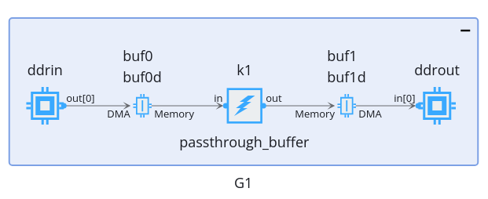

<table class="sphinxhide" style="width:100%;">
  <tr>
    <td align="center">
      <picture>
        <source media="(prefers-color-scheme: dark)" srcset="https://raw.githubusercontent.com/Xilinx/Image-Collateral/main/logo-white-text.png">
        
      </picture>
      <h1>AMD Vitis™ AI Engine Tutorials</h1>
      <a href="https://www.amd.com/en/products/software/adaptive-socs-and-fpgas/vitis.html">See Vitis™ Development Environment on amd.com</a>
        </br>
      <a href="https://www.amd.com/en/products/software/vitis-ai.html">See Vitis™ AI Development Environment on amd.com</a>
    </td>
  </tr>
</table>

# Tiling Parameter for External Memory

## Introduction

In this section we will analyze a single example that concentrate all features that have been to be managed to use external memory through _external\_buffer_ API.

There exists also the _gmio_ API but it is much less feature rich than the _external\_buffer_ API. The _gmio_ API is only capable of block of memory access, without using the efficiency of the buffer descriptors for complex access scheme.

## Matrix Transposition in Interface Tile

In this testcase the kernel _k1_ is surrounded by buffers and DDR on both sides:



The data coming from the DDR is directly copied on the buffer. The latter is copied to the output buffer. The DMA in the shim will take the data stream from the output buffer and copies it to the external memory in a transpose way.

```C++
 adf::external_buffer<int32> ddrin, ddrout;
 
 
 Graph1()
 {

    ddrin = adf::external_buffer<int32>::create({Dim0, Dim1, Dim2 * Dim3}, 0, 1);
    ddrout = adf::external_buffer<int32>::create({Dim1, Dim0, Dim2 * Dim3}, 1, 0);

    adf::read_access(ddrin.out[0]) = adf::tiling(
            {.buffer_dimension = {Dim0, Dim1, Dim2 * Dim3},
             .tiling_dimension = {Dim0, Dim1, 1},
             .offset = {0, 0, 0},
             .tile_traversal = {{.dimension = 2, .stride = 1, .wrap = Dim2*Dim3}}});

    adf::write_access(ddrout.in[0]) = adf::tiling(
        {.buffer_dimension = {Dim1, Dim0, Dim2 * Dim3},
         .tiling_dimension = {1, Dim0, 1},
         .offset = {0, 0, 0},
         .tile_traversal = {
             {.dimension = 0, .stride = 1, .wrap = Dim1},
             {.dimension = 2, .stride = 1, .wrap = Dim2 * Dim3}}});
       
    k1 = adf::kernel::create(passthrough_buffer<Dim0 * Dim1, 8>); // 64 pixels per tile

       ...
 }
```

The kernel accepts 64 samples per run. The input DDR sends 2 x 64 samples per iterations, which means that the kernel will be run 2 times per iteration. The output DDR receives 128 samples per iteration but organized in a transposed way.

On the testbench side, the user needs to provide the address of the DDR memory at which the data is stored at each iteration.

```C++
 G1.init();
 
 for(int iter=0;iter<NIterations;iter++)
 {
    // Sets the address
     G1.ddrin.setAddress(GMin[0]+128*iter);
     G1.ddrout.setAddress(GMout[0] + 128 * iter);

      // Lauches the DMA
     G1.ddrin.gm2aie_nb(G1.ddrin.out[0]);
     G1.ddrout.aie2gm_nb(G1.ddrout.in[0]);

     G1.run(1);
     
     // Wait up to the end of the transfers
     G1.ddrin.wait(G1.ddrin.out[0]);
     G1.ddrout.wait(G1.ddrout.in[0]);
 }

 G1.end();
```

Compile the design and run the simulation:

```shell
 make SECTION=extbuf aie aiesim
```

Verify the column organization of the output data:

```shell
Utils/GetTiles.py extbuf_aiesimulator_output/data/NoStamps_Output_1.txt 2D 8 8 0 3

------------------------------------------------------

filename: extbuf_aiesimulator_output/data/NoStamps_Output_1.txt
NCols: 8
NRows: 8
NLayers: 1
NImages: 1

------------------------------------------------------

Static Tile Selection

Tile: 0
 0  8 16 24 32 40 48 56
 1  9 17 25 33 41 49 57
 2 10 18 26 34 42 50 58
 3 11 19 27 35 43 51 59
 4 12 20 28 36 44 52 60
 5 13 21 29 37 45 53 61
 6 14 22 30 38 46 54 62
 7 15 23 31 39 47 55 63
------------------------------------------------------------
Tile: 1
 64  72  80  88  96 104 112 120
 65  73  81  89  97 105 113 121
 66  74  82  90  98 106 114 122
 67  75  83  91  99 107 115 123
 68  76  84  92 100 108 116 124
 69  77  85  93 101 109 117 125
 70  78  86  94 102 110 118 126
 71  79  87  95 103 111 119 127
------------------------------------------------------------
Tile: 2
128 136 144 152 160 168 176 184
129 137 145 153 161 169 177 185
130 138 146 154 162 170 178 186
131 139 147 155 163 171 179 187
132 140 148 156 164 172 180 188
133 141 149 157 165 173 181 189
134 142 150 158 166 174 182 190
135 143 151 159 167 175 183 191
------------------------------------------------------------
Tile: 3
192 200 208 216 224 232 240 248
193 201 209 217 225 233 241 249
194 202 210 218 226 234 242 250
195 203 211 219 227 235 243 251
196 204 212 220 228 236 244 252
197 205 213 221 229 237 245 253
198 206 214 222 230 238 246 254
199 207 215 223 231 239 247 255
------------------------------------------------------------
```

The testbench writes also a file with the input and the output side by side:

```shell
more  extbuf_aiesimulator_output/Output_Compare.txt

    1    2    3    4    5    6    7    8              1    9   17   25   33   41   49   57
    9   10   11   12   13   14   15   16              2   10   18   26   34   42   50   58
   17   18   19   20   21   22   23   24              3   11   19   27   35   43   51   59
   25   26   27   28   29   30   31   32              4   12   20   28   36   44   52   60
   33   34   35   36   37   38   39   40              5   13   21   29   37   45   53   61
   41   42   43   44   45   46   47   48              6   14   22   30   38   46   54   62
   49   50   51   52   53   54   55   56              7   15   23   31   39   47   55   63
   57   58   59   60   61   62   63   64              8   16   24   32   40   48   56   64

   65   66   67   68   69   70   71   72             65   73   81   89   97  105  113  121
   73   74   75   76   77   78   79   80             66   74   82   90   98  106  114  122
   81   82   83   84   85   86   87   88             67   75   83   91   99  107  115  123
   89   90   91   92   93   94   95   96             68   76   84   92  100  108  116  124
   97   98   99  100  101  102  103  104             69   77   85   93  101  109  117  125
  105  106  107  108  109  110  111  112             70   78   86   94  102  110  118  126
  113  114  115  116  117  118  119  120             71   79   87   95  103  111  119  127
  121  122  123  124  125  126  127  128             72   80   88   96  104  112  120  128

  129  130  131  132  133  134  135  136            129  137  145  153  161  169  177  185
  137  138  139  140  141  142  143  144            130  138  146  154  162  170  178  186
  145  146  147  148  149  150  151  152            131  139  147  155  163  171  179  187
  153  154  155  156  157  158  159  160            132  140  148  156  164  172  180  188
  161  162  163  164  165  166  167  168            133  141  149  157  165  173  181  189
  169  170  171  172  173  174  175  176            134  142  150  158  166  174  182  190
  177  178  179  180  181  182  183  184            135  143  151  159  167  175  183  191
  185  186  187  188  189  190  191  192            136  144  152  160  168  176  184  192

  193  194  195  196  197  198  199  200            193  201  209  217  225  233  241  249
  201  202  203  204  205  206  207  208            194  202  210  218  226  234  242  250
  209  210  211  212  213  214  215  216            195  203  211  219  227  235  243  251
  217  218  219  220  221  222  223  224            196  204  212  220  228  236  244  252
  225  226  227  228  229  230  231  232            197  205  213  221  229  237  245  253
  233  234  235  236  237  238  239  240            198  206  214  222  230  238  246  254
  241  242  243  244  245  246  247  248            199  207  215  223  231  239  247  255
  249  250  251  252  253  254  255  256            200  208  216  224  232  240  248  256

  257  258  259  260  261  262  263  264            257  265  273  281  289  297  305  313
  265  266  267  268  269  270  271  272            258  266  274  282  290  298  306  314
  273  274  275  276  277  278  279  280            259  267  275  283  291  299  307  315
  281  282  283  284  285  286  287  288            260  268  276  284  292  300  308  316
  289  290  291  292  293  294  295  296            261  269  277  285  293  301  309  317
  297  298  299  300  301  302  303  304            262  270  278  286  294  302  310  318
  305  306  307  308  309  310  311  312            263  271  279  287  295  303  311  319
  313  314  315  316  317  318  319  320            264  272  280  288  296  304  312  320
```


## Hardware Emulation and Hardware run

In order tu understand how to handle this kind of external buffer in hardware using a host code, the file `host.cpp`has been created in the directory `sw_extbuf`.

The buffer objects are created in memory with the usual `xrt::aie::bo`:

```C++
for(int g=0;g<NGraphs;g++)
{        
    InputBufferObject[g] = new xrt::aie::bo(device, FRAME_LENGTH * sizeof(int), xrt::bo::flags::normal, 0);
    InputMem[g] = InputBufferObject[g]->map<int32_t *>();
    for(int k=0;k<FRAME_LENGTH;k++)
        InputMem[g][k] = (k+1)*(g+1);
    printf("Graph %d Input memory virtual addr 0x%px\n",g, InputMem[g]);

    OutputBufferObject[g] = new xrt::aie::bo(device, FRAME_LENGTH * sizeof(int), 0, 0);
    OutputMem[g] = OutputBufferObject[g]->map<int32_t *>();
    for (int k = 0; k < FRAME_LENGTH; k++)
        OutputMem[g][k] = -999;
    printf("Graph %d Input memory virtual addr 0x%px\n",g, OutputMem[g]);
}    
```

The buffer ports are initialized on the I Engine array side using the `xrt::aie::buffer`:

```C++
// Start the output buffers DMAs
for (int g = 0; g < NGraphs; g++)
{
    outbuf[g] = new xrt::aie::buffer(device, xclbin_uuid, "G" + std::to_string(g+1) + ".ddrout");
    outbuf[g]->async(*OutputBufferObject[g], XCL_BO_SYNC_BO_AIE_TO_GMIO, FRAME_LENGTH * sizeof(int), /*offset*/ 0);
}

// Start the input buffers DMAs
for (int g = 0; g < NGraphs; g++)
{
    xrt::aie::buffer inbuf(device, xclbin_uuid, "G" + std::to_string(g+1) + ".ddrin");
    inbuf[g]->async(*InputBufferObject[g], XCL_BO_SYNC_BO_GMIO_TO_AIE, FRAME_LENGTH * sizeof(int), /*offset*/ 0);
}
```

The host code then waits for the end of the transfer using the `wait` method:
```C++
// Wait for the end of Output buffer DMAs
for (int g = 0; g < NGraphs; g++)
{
    outbuf[g]->wait();
}
```

There is a Makefile target to compile and run for hardware emulation and hardware run:

- `full_extbuf_hwemu`: compiles, links and run hw emulation
- `full_extbuf_sim_hwemu`: compiles, run aie simulation, links and run hw emulation
- `full_extbuf_hw`: compiles, links and generated sd_card (and a zipped version) to run in hw

## Support

GitHub issues will be used for tracking requests and bugs. For questions, go to [support.xilinx.com](https://support.xilinx.com/).

<p class="sphinxhide" align="center"><sub>Copyright © 2025 Advanced Micro Devices, Inc.</sub></p>

<p class="sphinxhide" align="center"><sup><a href="https://www.amd.com/en/corporate/copyright">Terms and Conditions</a></sup></p>
