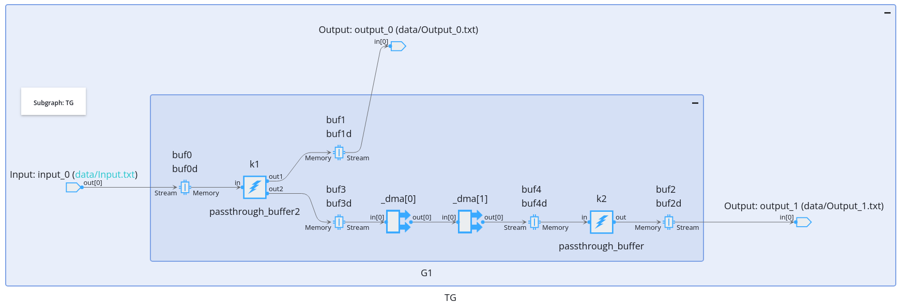
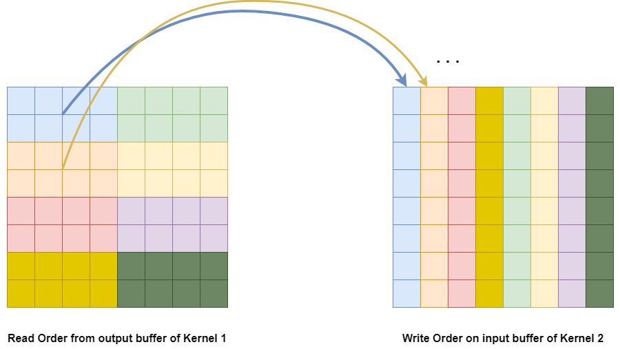
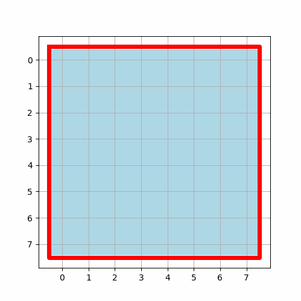

<table class="sphinxhide" style="width:100%;">
  <tr>
    <td align="center">
      <picture>
        <source media="(prefers-color-scheme: dark)" srcset="https://raw.githubusercontent.com/Xilinx/Image-Collateral/main/logo-white-text.png">
        
      </picture>
      <h1>AMD Vitis™ AI Engine Tutorials</h1>
      <a href="https://www.amd.com/en/products/software/adaptive-socs-and-fpgas/vitis.html">See Vitis™ Development Environment on amd.com</a>
        </br>
      <a href="https://www.amd.com/en/products/software/vitis-ai.html">See Vitis™ AI Development Environment on amd.com</a>
    </td>
  </tr>
</table>

# Tiling Parameter for  Memory Modules

## Introduction

## Test Case 1: Matrix Transpose

In this case, the kernel _k1_ is connected to kernel _k2_. A read access pattern is defined on the output buffer of kernel _k1_ so that a transposed version of the data is given to _k2_:

```C++
adf::connect(k1.out[1], k2.in[0]);
  adf::read_access(k1.out[1]) = adf::tiling({
         .buffer_dimension = {Dim0,Dim1},
         .tiling_dimension = {1,1},
         .offset = {0,0},
         .tile_traversal = {
         {.dimension=1,.stride=1,.wrap=Dim1},
         {.dimension=0,.stride=1,.wrap=Dim0}}});
```

The _aiecompiler_ automatically inserts a stream communication in between the output buffer of _k1_ and the input buffer of _k2_. These 2 buffers are no more the same:



Compile and run the design for testcase 1:

```shell
make SECTION=memmodule T1 x86 x86sim
```


_Output_0.txt_ contains the original data and _Output_1.txt_ contains the transposed one:

```shell
Utils/GetTiles.py memmodule_x86simulator_output/data/Output_0.txt 2D 8 8 1

------------------------------------------------------

filename: memmodule_x86simulator_output/data/Output_0.txt
NCols: 8
NRows: 8
NLayers: 1
NImages: 1

------------------------------------------------------

Static Tile Selection

Tile: 0
 0  1  2  3  4  5  6  7
10 11 12 13 14 15 16 17
20 21 22 23 24 25 26 27
30 31 32 33 34 35 36 37
40 41 42 43 44 45 46 47
50 51 52 53 54 55 56 57
60 61 62 63 64 65 66 67
70 71 72 73 74 75 76 77
```

```shell
 Utils/GetTiles.py memmodule_x86simulator_output/data/Output_1.txt 2D 8 8 0

------------------------------------------------------

filename: memmodule_x86simulator_output/data/Output_1.txt
NCols: 8
NRows: 8
NLayers: 1
NImages: 1

------------------------------------------------------

Static Tile Selection

Tile: 0
 0 10 20 30 40 50 60 70
 1 11 21 31 41 51 61 71
 2 12 22 32 42 52 62 72
 3 13 23 33 43 53 63 73
 4 14 24 34 44 54 64 74
 5 15 25 35 45 55 65 75
 6 16 26 36 46 56 66 76
 7 17 27 37 47 57 67 77
```


## Test Case 2

In this case, data reordering is too complex to be handled on a single Memory Module. The output buffer of Kernel 1 is read tile by tile from the output buffer and written stripe by stripe on the input buffer of kernel 2:



```C++
        adf::read_access(k1.out[1]) = adf::tiling(
           {.buffer_dimension = {Dim0, Dim1},
            .tiling_dimension = {4,2},
            .offset = {0, 0},
            .tile_traversal = {
                {.dimension = 1, .stride = 2, .wrap = Dim1/2},
                {.dimension = 0, .stride = 4, .wrap = Dim0/4}}});
        adf::write_access(k2.in[0]) = adf::tiling(
           {.buffer_dimension = {Dim0, Dim1},
            .tiling_dimension = {1, 8},
            .offset = {0, 0},
            .tile_traversal = {
                {.dimension = 0, .stride = 1, .wrap = Dim0}}});
```

The _aiecompiler_ automatically inserts a stream communication in between the output buffer of _k1_ and the input buffer of _k2_. All these data manipulation are done automatically by the DMAs, leaving the AI Engine compute performance for data processing only.




Compile and run simulation:

```shell
make data T2 x86 x86sim
```

And check the output:

```shell
Utils/GetTiles.py memmodule_x86simulator_output/data/Output_0.txt 2D 8 8 0 1
```
to get the original data organization:

```shell
Tile: 0
 0  1  2  3  4  5  6  7
10 11 12 13 14 15 16 17
20 21 22 23 24 25 26 27
30 31 32 33 34 35 36 37
40 41 42 43 44 45 46 47
50 51 52 53 54 55 56 57
60 61 62 63 64 65 66 67
70 71 72 73 74 75 76 77
```
 Type:

```shell
Utils/GetTiles.py memmodule_x86simulator_output/data/Output_1.txt 2D 8 8 0 1
```

to get the modified data organization:

```shell
Tile: 0
 0 20 40 60  4 24 44 64
 1 21 41 61  5 25 45 65
 2 22 42 62  6 26 46 66
 3 23 43 63  7 27 47 67
10 30 50 70 14 34 54 74
11 31 51 71 15 35 55 75
12 32 52 72 16 36 56 76
13 33 53 73 17 37 57 77
```


## Tensor Buffer Stream

There is another way to structure the access to the buffers within a kernel. The following example shows how to access a buffer using a tensor buffer stream.

The input buffer is filled in in a straightforward way but the access of the buffer that is managed using a stream-type way using ```make_tensor_descriptor``` and ```make_tensor_buffer_stream``` classes:

- ```tensor_descriptor``` is used to describe the access pattern of a 1D memory space as a multi-dimensional tensor.
- ```tensor_dim```: description of a dimension size.
- ```tensor_buffer_stream``` is the access class by itself that will follow the access patter described previously.

In the following explanation __the base data chunk is a valid vector type__.

### ```tensor_descriptor```

The basis of this class is to describe 2D or 3D volumes. If the dimensionality is higher, multiple 2D/3D structures are concatenated under the hood. Each dimension size is described using ```tensor_dim`` structure which is basically a pair _(size,step)_ each parameter being expressed in data vector entity:

- _size_: size of the dimension.
- _step_: increment required to take a step in this dimension.

For example:

```C++
auto desc = aie::make_tensor_descriptor<int16,16>(aie::tensor_dim(8u,2));
```

- The data unit is ```aie::vector<int16,16>```, 32 bytes.
- _8u_ : on dimension 0, there are 4 vectors
- _2_: the step is equal to 2 (2 x 32 = 64 bytes) to get the next vector element. This means that the first read vector element will be at address 0 and the following one at address 64.

Suppose that there are 256 _int16_ elements in the 1D buffer are: __0 1 2 3 4 5 ... 253 254 255__

- First extracted vector will be: __0 1 2 3 ... 13 14 15__
- Second extracted vector: __32 33 34 35 ... 45 46 47__
- Third extracted vector: __64 65 66 ... 77 78 79__
- __...__

a multi-dimensional access scheme is just a comma separated list of ```tensor_dim``` parameters, starting with the highest dimension:

```C++
auto desc = aie::make_tensor_descriptor<int16,16>(
                           aie::tensor_dim(2u,8),  // Dimension 1 description
                           aie::tensor_dim(4u,2)); // Dimension 0 description
```

The resulting vector extraction would be the same as the previous example. Let's understand how the data address is computed. Let say that we have a 3-dimension tensor descriptor:

- ``` (Size2,Step2)  (Size1,Step1)  (Size0,Step0)  ```
- The current index in each dimension is: ```(i2, i1, i0)```
  - 0 <= i0 < Size0
  - 0 <= i1 < Size1
  - 0 <= i2 : no limitation for last dimension
- The width of the base vector is ```W```

The starting address for each buffer access is computed as follows:
```C++
Offset = buffer address

O2 = W * i2 * Step2 
O1 = W * i1 * Step1
O0 = W * i0 * Step0

Address = Offset + O2 + O1 + O0
```

_Step_ and _Size_ can be set to get various behaviour:

- If _Step=0_ the access scheme described in previous dimensions is repeated _Size_ times.
- If the _Step_ of some dimension is smaller than the one of a lower dimension then the address generated will go back and forth. (cf. provided example in this tutorial).

### ```tensor_buffer_stream```

This class takes a tensor descriptor to perform the data read. A standard C++ stream access or the _pop()_ method can be used.

If the tensor descriptor dimension is larger than 3, it is defined recursively with 3D tensors and a last one with the remaining number of dimensions (the lower ones). In that case the N-dimension descriptor is logically understood as an outer (dimension N - (N%3)) and an inner tensor (dimension N%3). The operating stream is the inner one. You can get it by reading the overall stream using _pop()_ which returns the inner stream that you can use to read the data from the buffer. Once finished on the sub-tensor you re-read the global stream which advances the outer-stream and returns a new inner-stream.


### Test case 3


This is a 2D example where the step on dimension 1 is lower than the step on dimension 0. This result in an access scheme where the second half of the tensor is interleaved with the first half:
```C++
    auto po1 = aie::begin_vector<VectorLength>(out1);

    // Create a tensor descriptor:
    //        - Dimension 0: 2 elements (vectors of size VectorLength) with a step of 4 vectors in between each
    //        - Dimension 1: 1 element (actually no limit on last dimension) with a step of 1 in between each
    
    auto desc = aie::make_tensor_descriptor<int,VectorLength>(aie::tensor_dim(1u,1),aie::tensor_dim(2u,4)); 
    
    //Create a tensor buffer stream where buffer 'in' is associated with the tensor descriptor
    auto tbs = aie::make_tensor_buffer_stream((int *)in.data(), desc);

    aie::vector<int, VectorLength> v;
    
    // read from the tensor descriptor and write on the output buffer
    for(int i=0;i<FrameLengthOut/VectorLength;i++)
    {
        tbs >> v;     
        *po1++ = v;
    }
```

For the last 2 examples, the input data is composed of samples going from 0 to 1023, and then from 10000 to 11023.

All following offsets are expressed in vector size, the final address is computed with a base vector ```aie::vector<int32,8>``` hence 32 bytes. As vectors are composed of ```int32``` samples, the address divided by 4 is the sample value

| Index Dim 1 | Index Dim 0 | Offset 1 | Offset 0 | Final Offset | Final Address (/4) |
| :---: | :---: | :---: | :---: | :---: | :---: |
| 0 | 0 | 0*1 | 0*4 | 0 | 0 |
| 0 | 1 | 0*1 | 1*4 | 4 | 32 |
| 1 | 0 | 1*1 | 0*4 | 1 | 8 |
| 1 | 1 | 1*1 | 1*4 | 5 | 40 |
| 2 | 0 | 2*1 | 0*4 | 2 | 16 |
| 2 | 1 | 2*1 | 1*4 | 6 | 48 |
| 3 | 0 | 3*1 | 0*4 | 3 | 24 |
| 3 | 1 | 3*1 | 1*4 | 7 | 56 |

Compile and simulate this example:

```shell
make clean data SECTION=memmodule T3 x86 x86sim
```

Get the data output:

```shell
Utils/GetTiles.py memmodule_x86simulator_output/data/Output_0.txt 2D 8 8 0
```

```shell
Tile: 0
 0  1  2  3  4  5  6  7
32 33 34 35 36 37 38 39
 8  9 10 11 12 13 14 15
40 41 42 43 44 45 46 47
16 17 18 19 20 21 22 23
48 49 50 51 52 53 54 55
24 25 26 27 28 29 30 31
56 57 58 59 60 61 62 63
```

One can see the step of 4 vectors in between consecutive output on dimension 0 (0 --> 32), and the step of 1 vector on dimension 1 (0 --> 8).

## Test Case 4

This last example is a 4D tensor. The tensor descriptor is defined as follows:

```C++
    auto desc = aie::make_tensor_descriptor<int,VectorLength>(
                           aie::tensor_dim(2u,2),  // Dimension 3 description
                           aie::tensor_dim(2u,0),  // Dimension 2 description
                           aie::tensor_dim(4u,4),  // Dimension 1 description
                           aie::tensor_dim(2u,1)); // Dimension 0 description
```

The tensor has to be split in 2:

- the outer tensor is 3 dimensional: dimensions 3, 2 and 1
- the inner tensor is 1 dimensional: dimension 0

```C++
    // Create a tensor buffer stream where buffer 'in' is associated with the tensor descriptor
    auto tbs = aie::make_tensor_buffer_stream((int *)in.data(), desc);

    aie::vector<int, VectorLength> v;

    for(int outer=0;outer<2*2*4;outer++) // 3 outer dimensions
    {
        auto in_tbs = tbs.pop(); // get the inner tensor buffer stream
        for(int inner=0;inner<2;inner++)  // 1 inner dimension
        {
            in_tbs >> v;
            *po1++ = v;
        }
    }
```

- Dimension 0: 2 elements (vectors of size VectorLength) with a step of 1 vector in between each.
- Dimension 1: 4 elements (vectors of size VectorLength) with a step of 4 vectors in between each.
- Dimension 2: 2 elements (vectors of size VectorLength) with a step of 0 vectors in between each, hence a repetition of the previous dimensions access scheme.
- Dimension 3: 2 elements (vectors of size VectorLength) with a step of 2 vectors in between each.

Compile and simulate this example:

```shell
 make clean data SECTION=memmodule T4 x86 x86sim
 ```
 
Get the data output:

```shell
Utils/GetTiles.py memmodule_x86simulator_output/data/Output_0.txt 2D 8 32 0
```

```shell
  0   1   2   3   4   5   6   7
  8   9  10  11  12  13  14  15
 32  33  34  35  36  37  38  39
 40  41  42  43  44  45  46  47
 64  65  66  67  68  69  70  71
 72  73  74  75  76  77  78  79
 96  97  98  99 100 101 102 103
104 105 106 107 108 109 110 111
  0   1   2   3   4   5   6   7
  8   9  10  11  12  13  14  15
 32  33  34  35  36  37  38  39
 40  41  42  43  44  45  46  47
 64  65  66  67  68  69  70  71
 72  73  74  75  76  77  78  79
 96  97  98  99 100 101 102 103
104 105 106 107 108 109 110 111
 16  17  18  19  20  21  22  23
 24  25  26  27  28  29  30  31
 48  49  50  51  52  53  54  55
 56  57  58  59  60  61  62  63
 80  81  82  83  84  85  86  87
 88  89  90  91  92  93  94  95
112 113 114 115 116 117 118 119
120 121 122 123 124 125 126 127
 16  17  18  19  20  21  22  23
 24  25  26  27  28  29  30  31
 48  49  50  51  52  53  54  55
 56  57  58  59  60  61  62  63
 80  81  82  83  84  85  86  87
 88  89  90  91  92  93  94  95
112 113 114 115 116 117 118 119
120 121 122 123 124 125 126 127
```

- Dimension 0 gives the 2 first output vectors: 0-7 and 8-15
- Dimension 1 provides the step of 32 (4*8)
- The effect of the Dimension 2 is to repeat the previous access scheme
- The Dimension 3 repeats the previous access scheme with a step of 16 (2*8)


## Conclusion

This tutorial has shown how to use the tiling parameter to access the memory modules in a more complex way than a simple read/write access. It is possible to define a complex access pattern using tiling parameters at the output of the source kernel and at the input of the destination kernel. The _aiecompiler_ will automatically insert the necessary stream communication between the 2 kernels. 

The tensor buffer stream is a powerful tool to access the buffer in a more complex way from withinthe kernel itself. It is possible to define a multi-dimensional access scheme and to read the buffer in a stream way but with complex address generation under the hood.

## Support

GitHub issues will be used for tracking requests and bugs. For questions, go to [support.xilinx.com](https://support.xilinx.com/).

<p class="sphinxhide" align="center"><sub>Copyright © 2025 Advanced Micro Devices, Inc.</sub></p>

<p class="sphinxhide" align="center"><sup><a href="https://www.amd.com/en/corporate/copyright">Terms and Conditions</a></sup></p>
