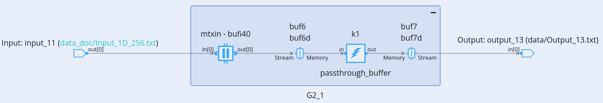
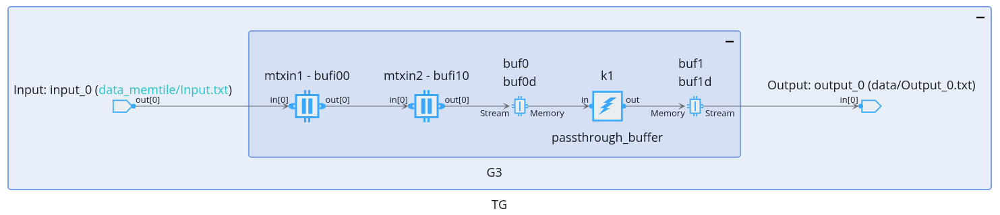
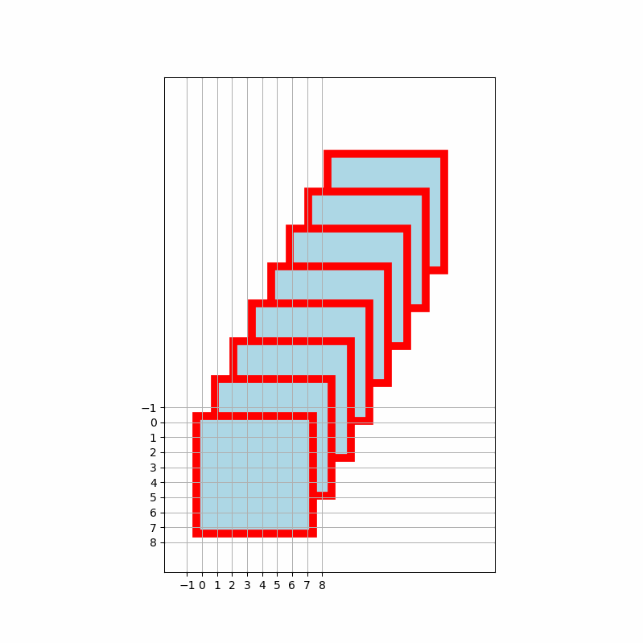

<table class="sphinxhide" style="width:100%;">
  <tr>
    <td align="center">
      <picture>
        <source media="(prefers-color-scheme: dark)" srcset="https://raw.githubusercontent.com/Xilinx/Image-Collateral/main/logo-white-text.png">
        
      </picture>
      <h1>AMD Vitis™ AI Engine Tutorials</h1>
      <a href="https://www.amd.com/en/products/software/adaptive-socs-and-fpgas/vitis.html">See Vitis™ Development Environment on amd.com</a>
        </br>
      <a href="https://www.amd.com/en/products/software/vitis-ai.html">See Vitis™ AI Development Environment on amd.com</a>
    </td>
  </tr>
</table>

# Tiling Parameter for  Memory Tiles

## Introduction

This section is focused on memory tiles. A number of different testcases are proposed that can be compiled easily using the _make_ utility. For example to activate test cases 1, 2 and 4 and perform aie compilation and simulation use the following:

```shell
make SECTION=memtile  T2 T3 x86 x86sim
```

Or

```shell
make SECTION=memtile T2 T3 aie aiesim
```

The data set is a 4D data set with dimensions 8x8x4x4:

- Dim0 = 8
- Dim1 = 8
- Dim2 = 4
- Dim3 = 4
 
Each sample is composed of its coordinates in this 4D space:

```shell
   0    1    2    3    4    5    6    7       100  101  102  103  104  105  106  107       200  201  202  203  204  205  206  207       300  301  302  303  304  305  306  307
  10   11   12   13   14   15   16   17       110  111  112  113  114  115  116  117       210  211  212  213  214  215  216  217       310  311  312  313  314  315  316  317
  20   21   22   23   24   25   26   27       120  121  122  123  124  125  126  127       220  221  222  223  224  225  226  227       320  321  322  323  324  325  326  327
  30   31   32   33   34   35   36   37       130  131  132  133  134  135  136  137       230  231  232  233  234  235  236  237       330  331  332  333  334  335  336  337
  40   41   42   43   44   45   46   47       140  141  142  143  144  145  146  147       240  241  242  243  244  245  246  247       340  341  342  343  344  345  346  347
  50   51   52   53   54   55   56   57       150  151  152  153  154  155  156  157       250  251  252  253  254  255  256  257       350  351  352  353  354  355  356  357
  60   61   62   63   64   65   66   67       160  161  162  163  164  165  166  167       260  261  262  263  264  265  266  267       360  361  362  363  364  365  366  367
  70   71   72   73   74   75   76   77       170  171  172  173  174  175  176  177       270  271  272  273  274  275  276  277       370  371  372  373  374  375  376  377

1000 1001 1002 1003 1004 1005 1006 1007      1100 1101 1102 1103 1104 1105 1106 1107      1200 1201 1202 1203 1204 1205 1206 1207      1300 1301 1302 1303 1304 1305 1306 1307
1010 1011 1012 1013 1014 1015 1016 1017      1110 1111 1112 1113 1114 1115 1116 1117      1210 1211 1212 1213 1214 1215 1216 1217      1310 1311 1312 1313 1314 1315 1316 1317
1020 1021 1022 1023 1024 1025 1026 1027      1120 1121 1122 1123 1124 1125 1126 1127      1220 1221 1222 1223 1224 1225 1226 1227      1320 1321 1322 1323 1324 1325 1326 1327
1030 1031 1032 1033 1034 1035 1036 1037      1130 1131 1132 1133 1134 1135 1136 1137      1230 1231 1232 1233 1234 1235 1236 1237      1330 1331 1332 1333 1334 1335 1336 1337
1040 1041 1042 1043 1044 1045 1046 1047      1140 1141 1142 1143 1144 1145 1146 1147      1240 1241 1242 1243 1244 1245 1246 1247      1340 1341 1342 1343 1344 1345 1346 1347
1050 1051 1052 1053 1054 1055 1056 1057      1150 1151 1152 1153 1154 1155 1156 1157      1250 1251 1252 1253 1254 1255 1256 1257      1350 1351 1352 1353 1354 1355 1356 1357
1060 1061 1062 1063 1064 1065 1066 1067      1160 1161 1162 1163 1164 1165 1166 1167      1260 1261 1262 1263 1264 1265 1266 1267      1360 1361 1362 1363 1364 1365 1366 1367
1070 1071 1072 1073 1074 1075 1076 1077      1170 1171 1172 1173 1174 1175 1176 1177      1270 1271 1272 1273 1274 1275 1276 1277      1370 1371 1372 1373 1374 1375 1376 1377

2000 2001 2002 2003 2004 2005 2006 2007      2100 2101 2102 2103 2104 2105 2106 2107      2200 2201 2202 2203 2204 2205 2206 2207      2300 2301 2302 2303 2304 2305 2306 2307
2010 2011 2012 2013 2014 2015 2016 2017      2110 2111 2112 2113 2114 2115 2116 2117      2210 2211 2212 2213 2214 2215 2216 2217      2310 2311 2312 2313 2314 2315 2316 2317
2020 2021 2022 2023 2024 2025 2026 2027      2120 2121 2122 2123 2124 2125 2126 2127      2220 2221 2222 2223 2224 2225 2226 2227      2320 2321 2322 2323 2324 2325 2326 2327
2030 2031 2032 2033 2034 2035 2036 2037      2130 2131 2132 2133 2134 2135 2136 2137      2230 2231 2232 2233 2234 2235 2236 2237      2330 2331 2332 2333 2334 2335 2336 2337
2040 2041 2042 2043 2044 2045 2046 2047      2140 2141 2142 2143 2144 2145 2146 2147      2240 2241 2242 2243 2244 2245 2246 2247      2340 2341 2342 2343 2344 2345 2346 2347
2050 2051 2052 2053 2054 2055 2056 2057      2150 2151 2152 2153 2154 2155 2156 2157      2250 2251 2252 2253 2254 2255 2256 2257      2350 2351 2352 2353 2354 2355 2356 2357
2060 2061 2062 2063 2064 2065 2066 2067      2160 2161 2162 2163 2164 2165 2166 2167      2260 2261 2262 2263 2264 2265 2266 2267      2360 2361 2362 2363 2364 2365 2366 2367
2070 2071 2072 2073 2074 2075 2076 2077      2170 2171 2172 2173 2174 2175 2176 2177      2270 2271 2272 2273 2274 2275 2276 2277      2370 2371 2372 2373 2374 2375 2376 2377

3000 3001 3002 3003 3004 3005 3006 3007      3100 3101 3102 3103 3104 3105 3106 3107      3200 3201 3202 3203 3204 3205 3206 3207      3300 3301 3302 3303 3304 3305 3306 3307
3010 3011 3012 3013 3014 3015 3016 3017      3110 3111 3112 3113 3114 3115 3116 3117      3210 3211 3212 3213 3214 3215 3216 3217      3310 3311 3312 3313 3314 3315 3316 3317
3020 3021 3022 3023 3024 3025 3026 3027      3120 3121 3122 3123 3124 3125 3126 3127      3220 3221 3222 3223 3224 3225 3226 3227      3320 3321 3322 3323 3324 3325 3326 3327
3030 3031 3032 3033 3034 3035 3036 3037      3130 3131 3132 3133 3134 3135 3136 3137      3230 3231 3232 3233 3234 3235 3236 3237      3330 3331 3332 3333 3334 3335 3336 3337
3040 3041 3042 3043 3044 3045 3046 3047      3140 3141 3142 3143 3144 3145 3146 3147      3240 3241 3242 3243 3244 3245 3246 3247      3340 3341 3342 3343 3344 3345 3346 3347
3050 3051 3052 3053 3054 3055 3056 3057      3150 3151 3152 3153 3154 3155 3156 3157      3250 3251 3252 3253 3254 3255 3256 3257      3350 3351 3352 3353 3354 3355 3356 3357
3060 3061 3062 3063 3064 3065 3066 3067      3160 3161 3162 3163 3164 3165 3166 3167      3260 3261 3262 3263 3264 3265 3266 3267      3360 3361 3362 3363 3364 3365 3366 3367
3070 3071 3072 3073 3074 3075 3076 3077      3170 3171 3172 3173 3174 3175 3176 3177      3270 3271 3272 3273 3274 3275 3276 3277      3370 3371 3372 3373 3374 3375 3376 3377
```

All test cases are based on the following graph:



This is a PLIO connected to a shared buffer. The output of this shared buffer is connected to a passthrough kernel through a ping-pong buffer located in the memory module.

The mtxin shared buffer is where is located all tiling parameter examples.

## Test case 1

In this test case each 2D tile is divided by 4 (2x2) read columnwise then rowwise. Each layer and Image is read one after the other. The 2 last dimensions can be seen as a single layer dimension of size 16.

The write access is done as a single block, and the read access defines the specific access order:

```C++
        uint D01 = Dim0 * Dim1; // 64
        uint D23 = Dim2*Dim3; // 16
        uint D0123 = D01 * D23; // 1024

        adf::write_access(mtxin.in[0]) = 
              adf::tiling({.buffer_dimension = {D0123}, // 1024
                     .tiling_dimension = {D0123}, // 1024
                     .offset = {0},
                     .tile_traversal = {}});

        adf::read_access(mtxin.out[0]) = 
           adf::tiling({.buffer_dimension = {Dim0, Dim1, D23}, // 8, 8, 16
                     .tiling_dimension = {(Dim0 / 2), (Dim1 / 2), 1}, // 4x4x1
                     .offset = {0, 0, 0},
                     .tile_traversal = {
                           {.dimension = 0, .stride = Dim0 / 2, .wrap = 2}, // Dim0/2 = 4
                           {.dimension = 1, .stride = Dim1 / 2, .wrap = 2}, // Dim1/2 = 4
                           {.dimension = 2, .stride = 1, .wrap = D23}}}); 
```

This partition is very simple. Let's compile this graph:

```shell
make SECTION=memtile T1 aie
```

This ends up with this error message
```shell
INFO: [aiecompiler 77-6570] For port 'TG.G1.mtxin.in[0]', allocated DMA is 'tile: memory, col:10, row:0, channel:0, dir:s2mm'
INFO: [aiecompiler 77-6570] For port 'TG.G1.mtxin.out[0]', allocated DMA is 'tile: memory, col:10, row:0, channel:0, dir:mm2s'
ERROR: [aiecompiler 77-4352] Failed to allocate buffer descriptors for TG.G1.mtxin due to insufficient number of available buffer descriptors.
```

Tiling parameters are specified but the error message states that the number of Buffer Descriptors (BD) is insufficient.

Let's count the number of buffer descriptors needed for these read and write accesses:

### Write access

Let's count the number of BDs needed for the write access:

| BD Dimension | stride | wrap |
| :---: | :---: | :---: |
| 0 | 1 | 1024 |

That's a single BD.

### Read Access

Let's decompose the tiling parameters for the read access:

| BD Dimension | stride | wrap | Comment |
| :---: | :---: | :---: | :--- |
| 0 | 1 | 4 | |
| 1 | 8 | 4 | Read a 4x4 tile |
| 2 | 4 | 2 | |
| 3 | 32 | 2 | Read the 2x2 tile structure |
| 4 | 64 | 16 | Read the 16 layers |

On BD dimension 3 we can see that stride x wrap = 32x2 = 64 which is the stride of the next dimension. The compiler automatically optimizes into:

| BD Dimension | stride | wrap | Comment |
| :---: | :---: | :---: | :--- |
| 0 | 1 | 4 | |
| 1 | 8 | 4 | Read a 4x4 tile |
| 2 | 4 | 2 | Read 2 tiles horizontally|
| 3 | 32 | 32 | Read 32 times these 2 horiontal tiles structure |

In the memory tile, 1 BD handles 4 stride values and 3 wraps. The last wrap value translate into 32 BDs which is above the 23 (24 - 1 for the write access) BDs available in the memory tile.

Uncomment the following lines:

```C++
D23 = 12;
adf::location<adf::dma>(mtxin.in[0]) = adf::dma_channel(adf::memory_tile,COL,0,0);
adf::location<adf::dma>(mtxin.out[0]) = adf::dma_channel(adf::memory_tile,COL,0,1);
```

The first line limits the number of layer to 12 which leads to 24 BD used which is the maximum available for odd or even DMA channel. To get a successful compilation MM2S and S2MM should have a different parity index, this is the purpose of the 2 last lines.

Recompile, it will be successful.

## Test case 2

Replacing 16 by 12 is not a good solution as all the data is not processed.

There are many ways to overcome this limitation. The simplest one is to consider the data as a 2D data set of size 8x(8x4x4) = 8x128.

The write access is identical, but now the read access is slightly different as it considers only 2 dimensions:

```C++
  adf::read_access(mtxin.out[0]) = adf::tiling({
       .buffer_dimension = {Dim0, Dim1*D23},           // 8x128
       .tiling_dimension = {(Dim0 / 2), (Dim1 / 2)}, // 4x4
       .offset = {0, 0},
       .tile_traversal = {
           {.dimension = 0, .stride = Dim0 / 2, .wrap = 2},
           {.dimension = 1, .stride = Dim1 / 2, .wrap = 2*D23}
       }});
```

Let's compile and simulate this test case:

```shell
make SECTION=memtile T2 aie aiesim
```

Let's have a look to the data written to the output bythe kernel:

```shell
Utils/GetTiles.py memtile_aiesimulator_output/data/NoStamps_Output_0.txt 2D 4 4 0 7
```

```shell

Tile: 0
 0  1  2  3
10 11 12 13
20 21 22 23
30 31 32 33
------------------------------------------------------------
Tile: 1
 4  5  6  7
14 15 16 17
24 25 26 27
34 35 36 37
------------------------------------------------------------
Tile: 2
40 41 42 43
50 51 52 53
60 61 62 63
70 71 72 73
------------------------------------------------------------
Tile: 3
44 45 46 47
54 55 56 57
64 65 66 67
74 75 76 77
------------------------------------------------------------
Tile: 4
100 101 102 103
110 111 112 113
120 121 122 123
130 131 132 133
------------------------------------------------------------
Tile: 5
104 105 106 107
114 115 116 117
124 125 126 127
134 135 136 137
------------------------------------------------------------
Tile: 6
140 141 142 143
150 151 152 153
160 161 162 163
170 171 172 173
------------------------------------------------------------
Tile: 7
144 145 146 147
154 155 156 157
164 165 166 167
174 175 176 177
------------------------------------------------------------
```

The 4 first tiles are the 4 quarters of the first layer of the first image, the following 4 tiles are the 4 quarters of the second layer of the first image and so on. This is what we expected.


## Test case 3

This example is slightly more difficult. The data is the same but we want zero-padding on dimension 0 and 1 (1 column before and after, 1 row before and after), with 6x6 tiles. We could specify the read access as in test case 1 including the zero-padding, but we know by advance that we won't have enough BDs.

A solution is to chain 2 memory tiles, the first one reading the layers one by one, and the second performing the zero-padding and the 6x6 tiling.

```C++
  // Connections
  adf::connect(din, mtxin1.in[0]);
  adf::write_access(mtxin1.in[0]) = adf::tiling({
        .buffer_dimension = {D0123},
         .tiling_dimension = {D0123},
         .offset = {0},
         .tile_traversal = {}});

  // Original data sent layer by layer
  adf::connect(mtxin1.out[0], mtxin2.in[0]);
  adf::read_access(mtxin1.out[0]) = adf::tiling({
         .buffer_dimension = {Dim0, Dim1, D23},       // 8x8x16
         .tiling_dimension = {(Dim0 ), (Dim1),1}, // 8x8x1
         .offset = {0, 0,0},
         .tile_traversal = {
             {.dimension = 2, .stride = 1, .wrap = D23}}});

  adf::write_access(mtxin2.in[0]) = adf::tiling({
          .buffer_dimension = {D01},
          .tiling_dimension = {D01},
          .offset = {0},
          .tile_traversal = {}});
          
  // Original data zero padded around, split in 4 tiles
  adf::connect(mtxin2.out[0], k1.in[0]);
  adf::read_access(mtxin2.out[0]) = adf::tiling({
           .buffer_dimension = {Dim0, Dim1},   // 8x8
          .tiling_dimension = {(Dim0/2+2), (Dim1/2+2)}, // 6x6
          .offset = {-1,-1},
          .tile_traversal = {
              {.dimension = 0, .stride = Dim0/2, .wrap = 2},
              {.dimension = 1, .stride = Dim1/2, .wrap = 2}}});

  adf::connect(k1.out[0], dout[0]);
```

Let's compile and simulate:

```shell
make SECTION=memtile T3 aie aiesim
```

The graph being created can be visualized in Vitis Analyzer:



Here are the extracted tiles from the original data set. The first 4 tiles are the 4 quarters of the first layer of the first image, the following 4 tiles are the 4 quarters of the second layer of the first image and so on. On all these quarters we can observe the zero-padding.



```shell
Utils/GetTiles.py memtile_aiesimulator_output/data/NoStamps_Output_0.txt 2D 6 6 0 7
```
```shell
------------------------------------------------------

filename: memtile_aiesimulator_output/data/NoStamps_Output_0.txt
NCols: 6
NRows: 6
NLayers: 1
NImages: 1

------------------------------------------------------

Static Tile Selection

Tile: 0
 0  0  0  0  0  0
 0  0  1  2  3  4
 0 10 11 12 13 14
 0 20 21 22 23 24
 0 30 31 32 33 34
 0 40 41 42 43 44
------------------------------------------------------------
Tile: 1
 0  0  0  0  0  0
 3  4  5  6  7  0
13 14 15 16 17  0
23 24 25 26 27  0
33 34 35 36 37  0
43 44 45 46 47  0
------------------------------------------------------------
Tile: 2
 0 30 31 32 33 34
 0 40 41 42 43 44
 0 50 51 52 53 54
 0 60 61 62 63 64
 0 70 71 72 73 74
 0  0  0  0  0  0
------------------------------------------------------------
Tile: 3
33 34 35 36 37  0
43 44 45 46 47  0
53 54 55 56 57  0
63 64 65 66 67  0
73 74 75 76 77  0
 0  0  0  0  0  0
------------------------------------------------------------
Tile: 4
  0   0   0   0   0   0
  0 100 101 102 103 104
  0 110 111 112 113 114
  0 120 121 122 123 124
...
```

## Test Case 4


This last test case shows a zero padding on dimension 1. There are 64 channels (dimension 0) containing each 512 samples. The kernel cannot absorb the totality of the samples so the processing is divided along the channels and the samples dimension. Along the dimension 1 zero-padding is activated to allow filtering along this dimension:

```C++
const uint D0 = 64;
const uint D1 = 512;
int Pad = 4;
const uint Tile0 = 8;
// const uint Tile0 =16;
const uint Tile1 = 4;
 mtxin = adf::shared_buffer<int32>::create({D0*D1}, 1, 1);
 adf::connect(din, mtxin.in[0]);
adf::write_access(mtxin.in[0]) = adf::tiling({
        .buffer_dimension = {D0*D1},
      .tiling_dimension = {},
      .offset = {0, 0},
      .tile_traversal = {}});

// Original data sent layer by layer
adf::connect(mtxin.out[0], k1.in[0]);
adf::read_access(mtxin.out[0]) = adf::tiling({
        .buffer_dimension = {D0,D1}, // 64x512
       .tiling_dimension = {Tile0,Tile1}, // 8x8
       .offset = {0, -Pad},
       .tile_traversal = {
           {.dimension = 1, .stride = Tile1, .wrap = (D1+2*Pad)/Tile1},
           {.dimension = 0, .stride = Tile0, .wrap = D0/Tile0}}});
```

If you try to compile as is (Tile dimensions: 8x4), you'll get an error because of an insufficient number of BDs.

```shell
make SECTION=memtile data T4 aie
```

Vertically we need 3 BD's:

- one for the top with the zero-padding (wrap=1)
- one for the middle part with a wrap of 128
- one for the bottom with the zero padding (wrap = 1)

As the width (dimension 0) is 64 with a width of 8, this means a wrap of 8, hence 3 (vertical BDs) x 8 (to process all columns) x 2 ([even and odd phase](DeepDiveBufferDescriptors.md#bd-counting)) = 48 BDs.

That is twice as much as what is available in the Memory Tile for a channel. Changing the Tile size to 16x4 will reduce to 24 BDs which is just OK.

Change:
```C++
const uint Tile0 = 8;
// const uint Tile0 =16;
```
into
```C++
//const uint Tile0 = 8;
const uint Tile0 =16;
```

Recompile and run simulation.

## Support

GitHub issues will be used for tracking requests and bugs. For questions, go to [support.xilinx.com](https://support.xilinx.com/).

<p class="sphinxhide" align="center"><sub>Copyright © 2025 Advanced Micro Devices, Inc.</sub></p>

<p class="sphinxhide" align="center"><sup><a href="https://www.amd.com/en/corporate/copyright">Terms and Conditions</a></sup></p>
